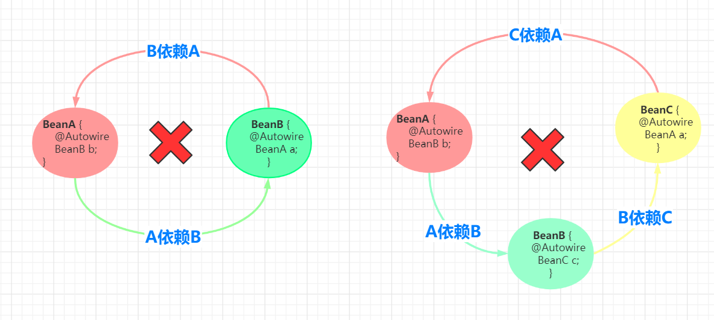
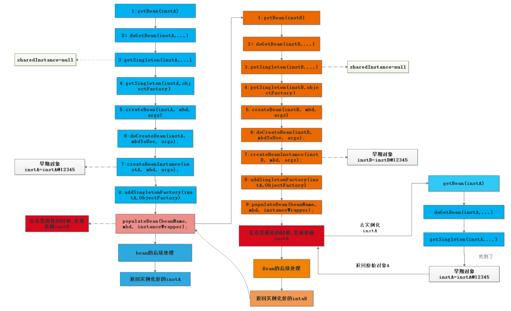
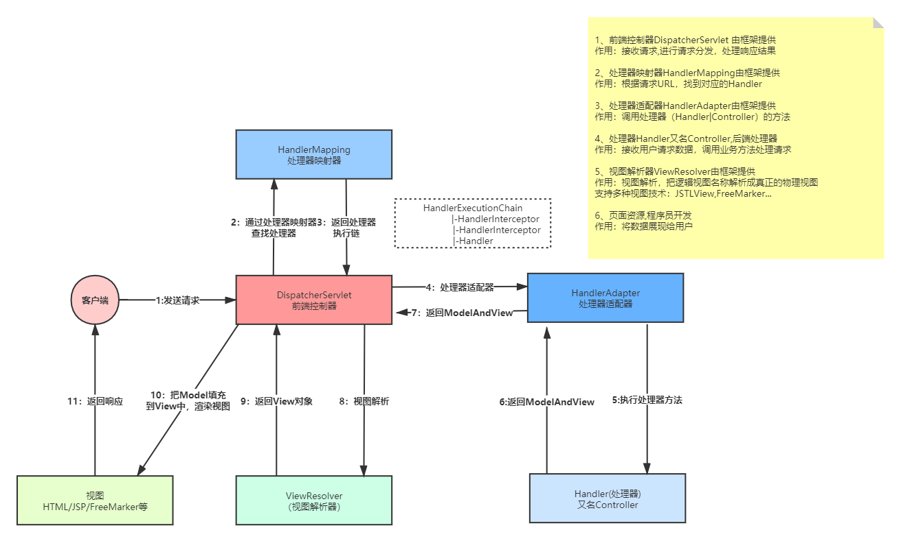

## Spring-IOC  

#### Bean定义的生成
- IOC容器启动，首先会创建BeanFactory实例，这个实例用于生产Bean
- 创建Bean定义的读取器，
  - 注册内置后置处理器（包括ConfigurationClassPostProcessor用于解析配置类、處理autowire、require、common、事件  
  （解析注解类的监听器实现了SmartInitializingSingleton）等注解的处理器），放入BeanDefinitionmap和name 
    - 生成ConfigurationClassPostProcessor定义
      - ConfigurationClassPostProcessor实现BeanDefinitionRegistryPostProcessor接口，可以注册BeanDefinition
        BeanDefinitionRegistryPostProcessor接口又扩展了BeanFactoryPostProcessor接口，
        BeanFactoryPostProcessor是Spring的扩展点之一，可以修改BeanDefinition。ConfigurationClassPostProcessor是Spring极
        为重要的一个类，必须牢牢的记住上面所说的这个类和它的继承关系。
      - 除了注册了ConfigurationClassPostProcessor，还注册了其他Bean，其他Bean也都实现了其他接口，比
        如BeanPostProcessor等。
        BeanPostProcessor接口也是Spring的扩展点之一。
    - 然后将bean定义注册到BeanDefinitionMap（spring内置类）
- 创建BeanDefinition扫描器:ClassPathBeanDefinitionScanner
  - 为了程序员可以手动调用AnnotationConfigApplicationContext对象的scan方法
- 注册我们的配置类
- 刷新容器
  - 创建bean工厂并进行属性填充
  - 调用bean工厂的后置处理器invokeBeanFactoryPostProcessors：1.生成bean定义，2.bean工厂后置处理器调用
    - 调用自定义的具有注册功能的处理器的后置房法
    - 生成BeanDefinitionRegistryPostProcessor，调用内置实现PriorityOrdered接口的该处理器的postProcessBeanDefinitionRegistry：
    典型的就是ConfigurationClassPostProcessor
      - 将有component，componetscan、impoirt、importresource、configration，有@Bean标注的方法的bean定义加入到候选的配置类集合中（这一步bean定义只有内置的和我们的配置类），
      所以拿到配置类的bean定义
      - ConfigurationClassParser：创建一个配置类解析器对象
      - 从我们的配置类上解析处ComponentScans的对象集合属性
      - 把我们扫描出来的类变为bean定义的集合 真正的解析
        - 设置CompentScan对象的includeFilters ，excludeFilters等属性，会添加默认排除配置类本身的过滤器
        - 循环我们的包路径集合
        - 判断是否为候选组件（即是否在排除和包含属性中）
        - ……
      - 把@Bean的方法和@Import 注册到BeanDefinitionMap中
    - 调用实现自定义Order接口BeanDefinitionRegistryPostProcessor。postProcessBeanFactory方法
    - 调用没有实现任何优先级接口的BeanDefinitionRegistryPostProcessor。postProcessBeanFactory方法
    - 调用 BeanDefinitionRegistryPostProcessor.postProcessBeanFactory方法
      - 该方法会对full配置类进行cglib代理：作用是当配置类中有@Bean方法引用另一个Bean，会避免重复创建，而是把这个Bean交给了容器管理
    - 调用自定义的BeanFactoryPostProcessor 。postProcessBeanFactory
  - 获取容器中所有的 未执行过的BeanFactoryPostProcessor，
    - 先调用BeanFactoryPostProcessor实现了 PriorityOrdered接口的postProcessBeanFactory方法
    - 再调用BeanFactoryPostProcessor实现了 Ordered.接口的postProcessBeanFactory方法
    - 调用没有实现任何方法接口的接口的postProcessBeanFactory方法
- registerBeanPostProcessors：注册我们bean的后置处理器
  - 去容器中获取所有的BeanPostProcessor 并实例化
    - 把实现了priorityOrdered的BeanPostProcessor 注册到容器中
    - 排序并且注册我们实现了Order接口的后置处理器
    - 注册我们普通的没有实现任何排序接口的的BeanPostProcessor
    - 注册.MergedBeanDefinitionPostProcessor类型的后置处理器 bean 合并后的处理， Autowired 注解正是通过此方法实现诸如类型的预解析
    - 注册ApplicationListenerDetector 应用监听器探测器的后置处理器
- ……
- finishBeanFactoryInitialization:实例化我们剩余的单例bean：beanFactory.preInstantiateSingletons()
  - 不是抽象的&& 单例的 &&不是懒加载的，不是工厂bean
  - getBean-->doGetBean
  - [九次处理器调用](https://www.processon.com/view/link/5f194e727d9c0835d38cc2cb).
    - 第1个bean后置处理器调用:InstantiationAwareBeanPostProcessors.postProcessBeforeInstantiation.事务以及切面解析都是通过导入了相关实现了
    我们的 BeanPostProcessor,InstantiationAwareBeanPostProcessor接口的类进行解析的
    - 实例化：创建bean实例化 使用合适的实例化策略来创建新的实例：工厂方法、构造函数自动注入、简单初始化 该方法很复杂也很重要
      - 通过SmartInstantiationAwareBeanPostProcessor后置处理器的determineCandidateConstructors方法来查找出对应的构造函数
      - 上一步返回null则使用无参构造函数
    - MergedBeanDefinitionPostProcessor： @AutoWired @Value的注解的预解析
    - 把我们的早期对象包装成一个singletonFactory对象 放到三级缓存该对象提供了一个getObject方法,该方法内部调用SmartInstantiationAwareBeanPostProcessor的getEarlyBeanReference
    方法，解决循环依赖涉及到的aop动态代理问题
    - 属性填充
      - InstantiationAwareBeanPostProcessor：postProcessAfterInstantiation是否终止赋值，一般返回true继续赋值
      - InstantiationAwareBeanPostProcessor：注入属性的获取：InstantiationAwareBeanPostProcessor。postProcessPropertyValues
      - 将获取的依赖属性应用到已经实例化的 bean 中
    - 初始化操作
      - 若我们的bean实现了Aware接口进行方法的回调（BeanNameAware，BeanClassLoaderAware，BeanFactoryAware）
      - applyBeanPostProcessorsBeforeInitialization：调用我们的bean的后置处理器的postProcessorsBeforeInitialization方法  @PostCust注解的方法
      - invokeInitMethods
        - 判断我们的容器中是否实现了InitializingBean接口，有就调用afterPropertiesSet（）
        - 调用有@Bean的initMethod
      - applyBeanPostProcessorsAfterInitialization：调用我们bean的后置处理器的PostProcessorsAfterInitialization方法，aop和事务都会在这里生存代理对象
  - 加入缓存：addSingleton(beanName, singletonObject);
  - SmartInitializingSingleton：调用afterSingletonsInstantiated方法
- 创建BeanDefinition注册器
- 注册配置类为BeanDefinition： register(annotatedClasses);
- 利用BeanFactory将BeanDefinitionMap中的BeanDefinition实例化，会调用一系列BeanFactoryPostProcessor后置处理器
- 实例化BeanDefinition的过程中会调用一系列BeanPostProcessor后置处理器

#### BeanFactory生产Bean
- 创建实例
- 填充属性
  - populateBean(beanName, mbd, instanceWrapper);//填充属性，炒鸡重要
  - 会进行aware系列接口的回调
  - BeanPostProcessor的postProcessBeforeInitialization方法
  - afterPropertiesSet init-method
  - BeanPostProcessor的postProcessAfterInitialization方法
    Spring Bean的生命周期
    Spring In Action以及市面上流传的大部分博客是这样的：
#### 生命周期
- 1. 实例化Bean对象，这个时候Bean的对象是非常低级的，基本不能够被我们使用，因为连最基本的属性都没有设置，可以理解为
 连Autowired注解都是没有解析的；
- 2. 填充属性，当做完这一步，Bean对象基本是完整的了，可以理解为Autowired注解已经解析完毕，依赖注入完成了；
- 3. 如果Bean实现了BeanNameAware接口，则调用setBeanName方法；
- 4. 如果Bean实现了BeanClassLoaderAware接口，则调用setBeanClassLoader方法；
- 5. 如果Bean实现了BeanFactoryAware接口，则调用setBeanFactory方法；
- 6. 调用BeanPostProcessor的postProcessBeforeInitialization方法；
- 7. 如果Bean实现了InitializingBean接口，调用afterPropertiesSet方法；
- 8. 如果Bean定义了init-method方法，则调用Bean的init-method方法；
- 9. 调用BeanPostProcessor的postProcessAfterInitialization方法；当进行到这一步，Bean已经被准备就绪了，一直停留在应用的
   上下文中，直到被销毁；
- 10. 如果应用的上下文被销毁了，如果Bean实现了DisposableBean接口，则调用destroy方法，如果Bean定义了destory-method
    声明了销毁方法也会被调用。
#### 初始化完成
解析8种实现方式
类实现ApplicationContextAware，重写setApplicationContext()方法
类实现InitializingBean，重写afterPropertiesSet()方法
在类中的方法上，添加@PostConstruct注解。（@PreDestroy注销时使用）
类实现BeanPostProcessor，重写postProcessBeforeInitialization()、postProcessAfterInitialization()方法
类实现 SmartLifecycle，重写相关方法
类实现ApplicationContextListener，重写onApplicationEvent()方法
类实现ApplicationRunner，重写run()方法
类实现CommandLineRunner，重写run()方法
#### 循环依赖
- Spring中A依赖B，B依赖A在初始化的时候就形成了循环依赖    
-
- 解决办法：三级缓存，如果沒有循环依赖的话，用不到二、三级缓存。如果有循环依赖没有aop也会用到三级缓存
  - 一级缓存：存放实例化、属性填充（调用populate()方法时进行）、初始化完成的bea 
  - 二级缓存：存放实例化完成的Bean，还未进行属性填充和初始化（早期对象）  
  - 三级缓存：存放封装了早期对象的函数式接口（ObjectFactory），在IOC后期的过程中，当Bean调用了
  构造函数时就会将早期对象封装成ObjectFactory，暴露在三级缓存中。spring的aop动态代理是在bean初始  
  化以后创建的，但是如果有循环依赖的话，无法等到初始化完成，因为此时已经完成了属性填充  
- 加载过程：  
首先创建A，1.调用getsingleton（）：getsingleton（）从一级缓存中取，取到直接返回；取不到并且正在创建的话从二级缓存中取  
，有的话返回该bean，没有的话并且正在创建，则从三级缓存中取，取出来的话回调ObjectFactory的方法创建实例放入二级缓存   
，返回创建好的实例；2.如果getsingleton（）返回null，判断是否已经加入正在创建集合，没有的话加入，然后实例化、将早期实例封装成ObjectFactory  
暴露在三级缓存中。3.属性填充：调用getsingleton（）获取B，过程同上，当填充到B里边的A时，则能获取到三级缓存中创建的早期实例A进行填充并放入二级缓存，最后移除二  
级缓存中的B，将B填充到一级缓存，最后移除二、三级缓存中的B。4.递归结束将B填充到A的属性，如果二级缓存中存在A则将填充到一级缓存，最后移除二、三级缓存中的A，
- 
-   
- 两级缓存的意义
  - 将实例化后的BEAN与初始化完成的BEAN分开存储，同时利用同步锁防止多线程时获取到未初始化完成的BEAN
- 三级缓存的意义
  - 级缓存，一级缓存存放完整的bean，二级缓存存放实例化完成还未进行属性填充的bean，正常二级缓存就可以解决循环依赖  
    ，三级缓存是为解决循环依赖并且有代理时，不打破bean生成的生命周期。如过A依赖B，B依赖A。B需要的A应该是代理的A。正常  
    代理对象的生成是基于后置处理器，是在被代理的对象初始化后期调用生成的，所以如果你提早代理了其实是违背了 Bean 定义的生命周期。  
    所以 Spring 先在一个三级缓存放置一个工厂，如果产生循环依赖，那么就调用这个工厂提早得到代理对象。如果没产生依赖，这个工  
    厂根本不会被调用，所以 Bean 的生命周期就是对的。
- spring能解决构造函数的循环依赖问题吗？
  - 不能，循环依赖是在实例化后完成，而调用构造函数是尚未创建实例
- 多例BEAN能不能解决循环依赖？
  - 不能，多例模式下并未将实例放进缓存
  
#### spring监听器   接口方式和注解方式 实现原理：观察者模式（事件、监听器、事件发布）
- 单例Bean创建完毕刷新和关闭容器的时候都有相应的内置监听器， 实现SmartInitializingSingleton接口的类也会在bean创建完毕执行

#### spring AOP   面向切面编程思想利用动态代理实现。
- 配置方式演进过程 基于接口-> xml -> Aspectj注解
- 如果使用接口则使用的JDK动态代理，如果没有接口，则使用的cglib。AOP要依赖与IOC容器进行管理，只能增强的Bean的方法  
，如果没有注入到容器，无法利用AOP增强
- Aspectj提供了切点解析和匹配以及注解支持，属于静态织入，通过修改代码实现，织入时机可以使编译前、编译后、类加载的时候，  
他提供了Aop的完全解决方案。Spring Aop则是在容器启动的时候生成代理来实现，在方法调用上会增加栈的深度，性能不如Aspectj，  
用于企业级开发中普遍的Aop需求。Aspectj在运行前已经完成了织入，没有运行的额外开销。
- 将与主业务无关的逻辑抽离出来，减少耦合。利用动态代理对已有方法进行增强
- Aspect（切面）管理通知和切点，通知即为对方法的增强逻辑
- pointcut（切点）指定需要增强的方法
- 织入 将增强逻辑切入的指定法法中（利用动态代理）
- advisor 封装了advice（通知）和pointcut（切点）
- 注解方式aop：开启注解，定义pointcut指定增强的方法。通知定义增强（befor、after、around）
- 注解方式的Aop
  - advisor是在第一个bean后置处理器执行时生成，找到所有的Aspectj注解的类，将befor、after这些增强封装成advisor
  - createBrean时，bean初始化后，后置处理器调用时，拿到之前所有的advisor的pointcut调用match匹配判断是否生产成当前bean的代理类
  - 调用代理类时，将advisor转换为intercrptor，利用责任链的模式将所有的advisor递归调用一遍
- 如果有接口则会用jdk的动态代理，如果进行注解设置了并且没有接口则会使用cglib。有设置但有接口也会使用jdk动态代理
  - jdk动态代理需要实现接口，自己生成字节码文件，通过反射进行方法增强
  - cglib利用ASM组件生成多个字节码文件，通过继承，直接调用子类方法进行增强

#### spring声明式事务。
- ACID 原子性、一致性、隔离性、持久性
- 事务传播：七种
  - 当前有事务就加入当前事务，没有就创建
  - 有就加入，没有以非事务方式执行
  - 有就加入，没有抛异常
  - 新建事务，有事务就先挂起当前事务
  - 以非事务方式执行，有事务就挂起当前事务
  - 以非事务方式执行，有事务抛异常
  - 如果当前存在事务，则在嵌套事务内执行。如果当前没有事务，则执行与PROPAGATION_REQUIRED类似的操作。
- 使用事务：注解开启事务
- Aop的后置处理器的优先级高于事务后置处理器的优先级，会进行覆盖
- 事务的advisor是容器启动的时候内置的，里边封装了事务的属性源，用于解析Transactional注解，而springaop是自己手写表达式
- 匹配的时候 类的方法-> 父类方法 -> 接口方法 ->类上
- 事务生效：1.执行带有Transactional注解的方法 2.代理类执行责任链调用 3.判断是不是责任链最后一个，是的话执行具体方法 4.不是  
的话拿到之前解析的事务属性，开启事务，责任递归调用具体方法（操作数据库），异常回滚。执行完毕提交事务
- 融合事务，嵌套事务不提交，和外部事务一起提交
- 挂起事务（嵌套事务中出现），把嵌套事务最为顶层事务，把外层事务暂存
- 嵌套事务只会存一个connection
- -spring4 日志：jcl，jcl已经停止更新

#### spring MVC
- 早期：请求 -> JSP -> JAVA BEAN -> 数据源 jsp同时担任处理器和视图展示
- 演进：请求 -> serverlet（C）  -> JAVA BEAN（M） -> 数据源，然后处理器将数据返  
给jsp（V）。视图展示和处理器和视图展示
- 
- 拦截器：springmvc容器启动的时候加载进去的
- spring ioc容器扫描的时候不回加载mvc的bean，mvc的容器是会加载spring的Bean

