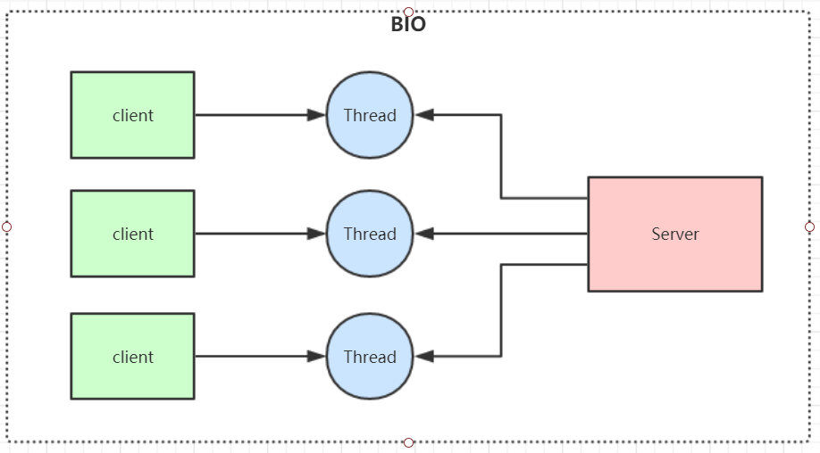
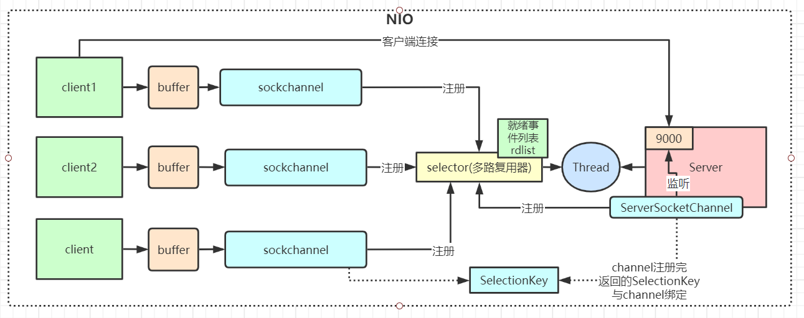
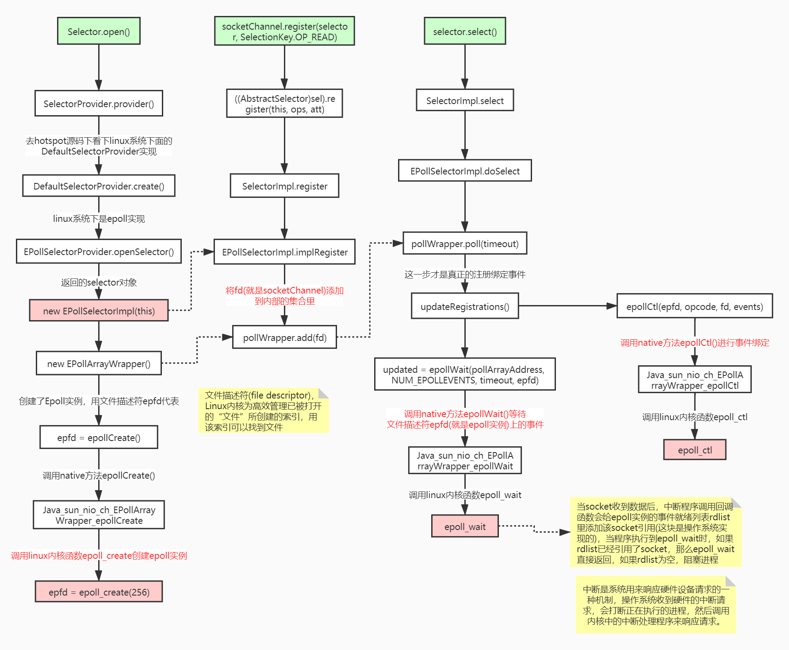
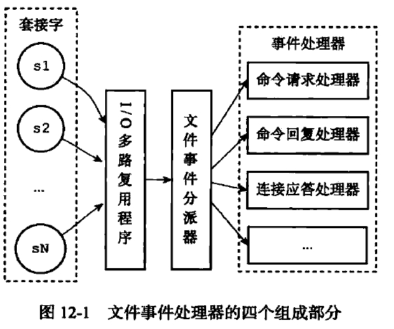

## I/O模型

#### 同步阻塞主线程  异步不会阻塞

#### BIO（blocking io） 同步阻塞
- 
- 阻塞IO
- 阻塞客户端请求
- 多线程处理，开启线程过多，上下文切换
- 如果大部分请求不发送数据，会阻塞线程，浪费资源，无法支持太多线程
- BIO 方式适用于连接数目比较小且固定的架构， 这种方式对服务器资源要求比较高， 但程序简单易理解。
#### NIO(new/non blocking io) 同步非阻塞
- 
- 服务器实现模式为一个线程可以处理多个请求(连接)，客户端发送的连接请求都会注册到多路复用器selector上，多路复用  
器轮询到连接有IO请求就进行处理，JDK1.4开始引入。
- 1.4 nio通过select或者poll来实现，每次遍历所有的channel，有读写事件就进行处理，没有的话继续遍历，1.4之后引入  
epoll，基于事件响应机制来优化Nio
- 三大控件
  - channel，buffer缓冲区，底层为数组
  - channel会注册到selector上，由selector根据channel读写事件的发生，交由空闲的线程处理
  - NIO的channel都是即可以读，也可以写
- selector.open 创建多路复用器 底层为调用操作系统函数epoll_create创建epoll文件描述符
- socketchannel.register 将channel注册到多路复用器 将channel对应socket文件描述添加到内部集合
- selector.select阻塞等待需要处理的事件 
  - 将内部集合中的事件绑定到epoll文件描述符上 epoll_ctl
  - 当socket有事件时，操作系统中断程序调用回调函数给epoll文件描述符的事件就序列表rdlist里添加该socket的引用
  - 当程序执行到epoll_wait时，如果rtlist引用了socket那么epoll_wait直接返回，没有的话阻塞
#### epoll实现
 - 
- nio流程
  - java应用程序调用操作系统内核函数socket，获取到socket文件描述符
  - 再创建一个selector对象，对应操作系统epoll文件描述符
  - 将socket上的事件绑定到selector对应的epoll上进行事件的异步监听
  - 将对事件的处理交由内核来处理，而不是进行无效遍历
#### select poll epoll
- select遍历socket文件描述符数组，有1024上限
- poll遍历链表，无上限
- epoll回调，为hash表，事件通知方式，操作系统底层实现，无上限
#### redis线程模型
- 
  - Redis 内部使用文件事件处理器 file event handler ，这个文件事件处理器是单线程的，所以 Redis 才叫做单线  
  程的模型。它采用 IO 多路复用机制同时监听多个 socket，将产生事件的 socket 压入内存队列中，事件分派器根据 socket 上的事件类型来选择对应的事件处理器进行处理。
  - 文件事件处理器的结构包含 4 个部分： 
    - 多个 socket 
    - IO 多路复用程序 
    - 文件事件分派器 
    - 事件处理器（连接应答处理器、命令请求处理器、命令回复处理器） 
    - 多个 socket 可能会并发产生不同的操作，每个操作对应不同的文件事件，但是 IO 多路复用程序会监听多个 socket，会将产生事件的 socket  
    放入队列中排队，事件分派器每次从队列中取出一个 socket，当被监听的socket准备好执行连接应答、读取、写入、关闭等操作时，与操作对应文件事  
    件就会产生，这事文件事件处理器就会调用之前关联好的事件处理器来处理这些事件。实现了高性能的网络通信模型  
    socket 的事件类型交给对应的事件处理器进行处理。
