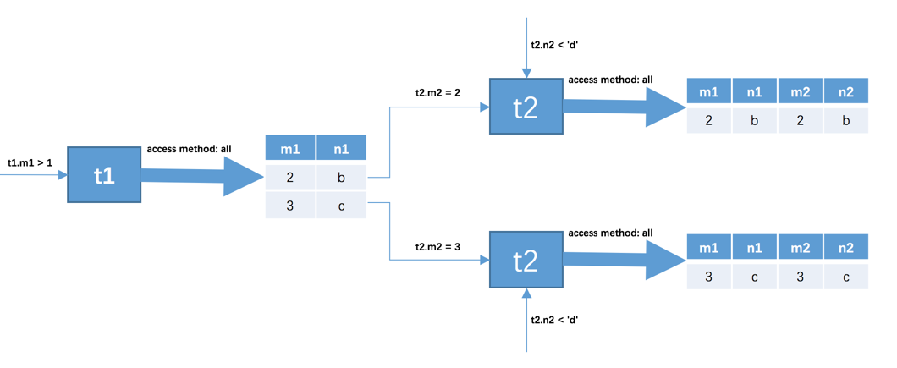
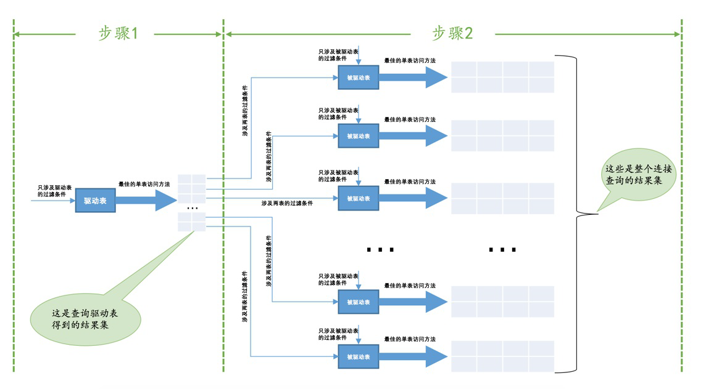

### mysql连接原理 

#### 连接概念
- mysql连接的本质就是将各个连接表中的记录都取出来，依次匹配，最后将满足条件的结果集返回给用户。  
连接查询的结果集中包含一个表中的每一条记录与另一个表中每一条记录相匹配的结果，我们称之为笛卡尔积。  
- 连接查询的过程  
1. 首先确认第一个需要查询的表，我们称之为驱动表。然后根据仅针对驱动表的条件进行最优查询，得到第  
一个结果集。  
2. 针对上一步得到的结果集到被驱动表中查询匹配的记录，匹配是指匹配关联条件。然后将结果集返回。  
2.   SELECT * FROM t1, t2 WHERE t1.m1 > 1 AND t1.m1 = t2.m2 AND t2.n2 < 'd';  

> - 执行过程  
  -   
  
  - 步骤

  - 

  - 如果有三个表关联的话，步骤2的结果集会作为驱动表，然后第三个表就会作为被驱动表。就是所谓的嵌套循环连接。  

      驱动表只访问一次，而被驱动表可能被多次访问，这取决与驱动表返回的结果集条数。

#### 内连接外链接的区别

内连接不会返回被驱动表中不匹配的结果集，并且内连接中where条件和on子句的条件是等效的，表顺序可以互换，不影响  

最后结果。而外连接会返回被驱动表中不匹配的记录，会把不匹配的的记录相应  

字段置为空。  

- where字句中的过滤条件

  > 无论是内连接还是外连接，凡是不满足where过滤条件的记录都不会被返回

- ON子句中的条件

  > 对于外链接来说，如果无法在被驱动表中找到匹配ON子句条件的记录，该记录仍会被加入到结果集中，对应  
  >的被驱动表的各个字段null处理

#### 基于块的循环嵌套连接  

##### 扫描表

> 扫描表的过程其实就是将磁盘中的数据加载到内存中，然后在内存中进行条件过滤筛选。如果表中数据量量大的话，扫描前边  
>
> 记录的时候可能后边的记录还在磁盘上，当扫描的后边记录的时候内现可能不足，就会把前边的记录从内存中清理掉。而在循环  
>
> 嵌套连接查询的时候，可能会多次查询被驱动表，就会对此进行磁盘I/O,代价比较大。

##### join buffer  

> 当进行连接查询的时候，先申请一块内存，将符合条件的驱动表的若干记录放入这块内存，然后拿被驱动表的一条记录一次性和驱  
>
> 动表中的记录在内存中进行比较，这样显著减少被驱动表磁盘I/O的代价。同时，驱动表中的列并不会全部放入join buffer中，只有  
>
> 查询列表中的列和符合过滤条件中的列才会放入join buffer中

- 