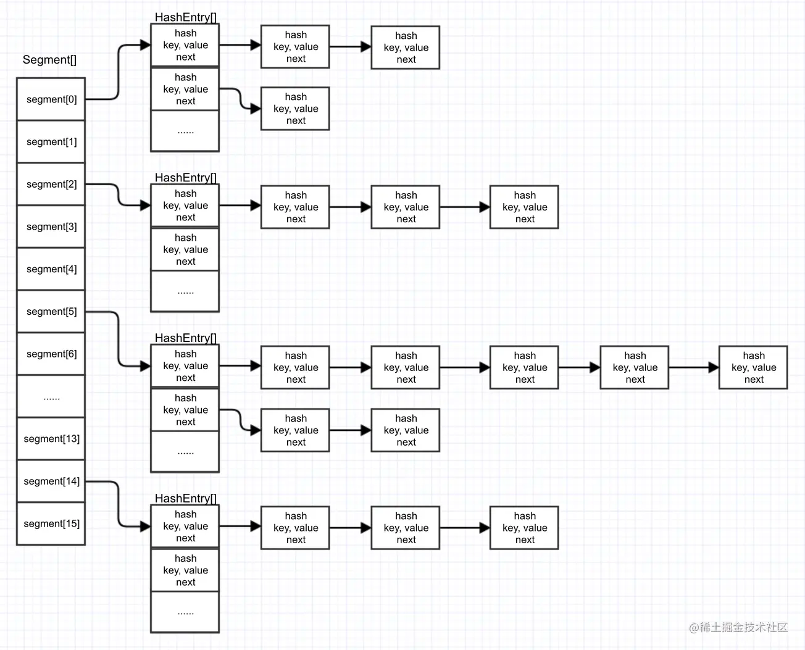
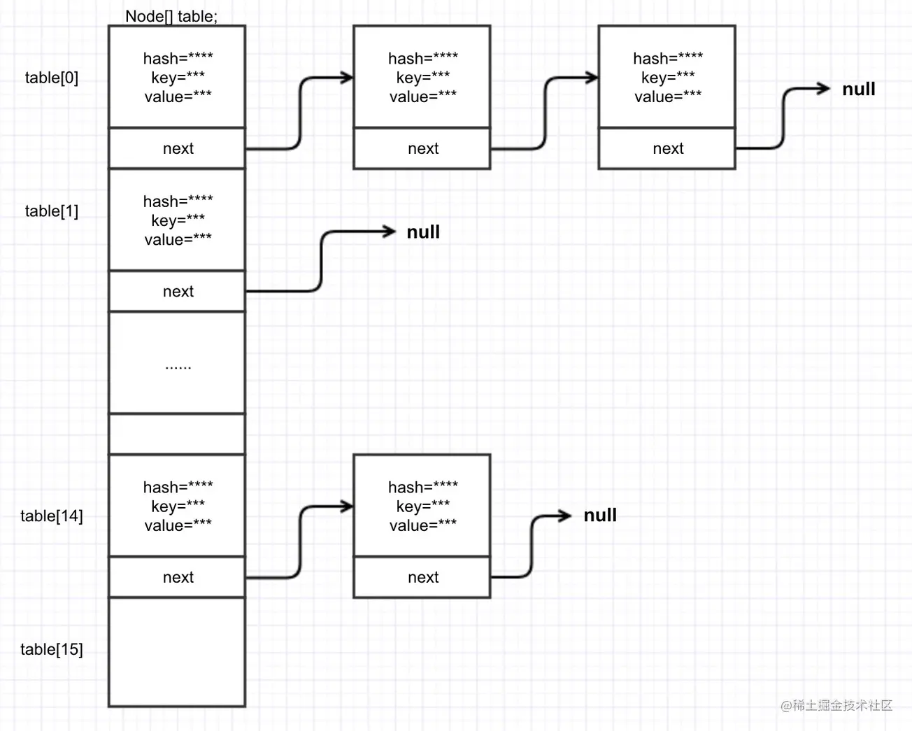

## hashmap
- [map](https://tech.meituan.com/2016/06/24/java-hashmap.html).
- [concurrentmap](https://juejin.cn/post/6844903813892014087).
- hashmap
  - put
    - 先看链表长度是否要转红黑树，先转在插入
    - 插入完以后判断是否需要扩容
  - 扩容
    - 数组长度从16到32，其实只是多了一个bit位的运算，我们只需要在意那个多出来的bit为是0还是1，是0的话索引不变，是1的话索引变为当前索引值+扩容的长度，比如5变成5+原数组长度=21
    - 这样的扩容方式不仅节省了重新计算hash的时间，而且保证了当前桶中的元素总数一定小于等于原来桶中的元素数量，避免了更严重的hash冲突，均匀的把之前冲突的节点分散到新的桶中去
    - 扩容的时候会把红黑树拆成两个子树，如果子树节点数小于等于6则转化为链表
  - 多线程的put可能导致元素的丢失
    - put和get并发时，可能导致get为null
    - DK7中HashMap并发put会造成循环链表，导致get时出现死循环
      - 1.7使用头插法，多线程扩容时会使链表顺序倒置，修改了链表节点的引用
      - 发生在多线程并发resize的情况下。
      - 如果get一个在这个链表中不存在的key时，就会出现死循环了。
- concurrenthashMap
  - 1.7
  - 
  - ConcurrentHashMap提出了分段锁的解决方案。  
    - 默认16个锁，扩容是针对segment扩容的，所以锁得数量不变
    - ConcurrentHashMap中维护着一个Segment数组，每个Segment可以看做是一个HashMap。  
    - 而Segment本身继承了ReentrantLock，它本身就是一个锁。  
    - 在Segment中通过HashEntry数组来维护其内部的hash表。  
    - 每个HashEntry就代表了map中的一个K-V，用HashEntry可以组成一个链表结构，通过next字段引用到其下一个元素。
  - put:
    - // 因为segment本身就是一个锁  
      // 这里调用tryLock尝试获取锁  
      // 如果获取成功，那么其他线程都无法再修改这个segment  
      // 如果获取失败，会调用scanAndLockForPut方法根据key和hash尝试找到这个node，如果不存在，则创建一个node并返回，如果存在则返回null  
      // 查看scanAndLockForPut源码会发现他在查找的过程中会尝试获取锁，在多核CPU环境下，会尝试64次tryLock()，如果64次还没获取到，会直接调用lock()  
      // 也就是说这一步一定会获取到锁  
      - HashMap的线程安全问题大部分出在扩容(rehash)的过程中。  
        ConcurrentHashMap的扩容只针对每个segment中的HashEntry数组进行扩容。  
        由上述put的源码可知，ConcurrentHashMap在rehash的时候是有锁的，所以在rehash的过程中，其他线程无法对segment的hash表做操作，这就保证了线程安全。  
  - 1.8
  - 
  - JDK8与JDK7的实现由较大的不同，JDK8中不在使用Segment的概念，他更像HashMap的实现方式(数组+链表+红黑树)。
  - ConcurrentHashMap是用table这个成员变量来持有hash表的，table的初始化采用了延迟初始化策略，他会在第一次执行put的时候初始化table。
  - 成员变量sizeCtl在ConcurrentHashMap中的其中一个作用相当于HashMap中的threshold，当hash表中元素个数超过sizeCtl时，触发扩容；  
    他的另一个作用类似于一个标识，例如，当他等于-1的时候，说明已经有某一线程在执行hash表的初始化了，一个小于-1的值表示某一线程正在对hash表执行resize。  
    这个方法首先判断sizeCtl是否小于0，如果小于0，直接将当前线程变为就绪状态的线程。  
    当sizeCtl大于等于0时，当前线程会尝试通过CAS的方式将sizeCtl的值修改为-1。修改失败的线程会进入下一轮循环，判断sizeCtl<0了，被yield住；修改成功的线程会继续执行下面的初始化代码。  
    在new Node[]之前，要再检查一遍table是否为空，这里做双重检查的原因在于，如果另一个线程执行完#1代码后挂起，此时另一个初始化的线程执行完了#6的代码，此时sizeCtl是一个大于0的值，    
    那么再切回这个线程执行的时候，是有可能重复初始化的。关于这个问题会在下图的并发场景中说明。
  - put
    - hash表上没有元素时:tabAt方法通过Unsafe.getObjectVolatile()的方式获取数组对应index上的元素，getObjectVolatile作用于对应的内存偏移量上，是具备volatile内存语义的。  
      如果获取的是空，尝试用cas的方式在数组的指定index上创建一个新的Node。
    - hash碰撞时:不同于JDK7中segment的概念，JDK8中直接用链表的头节点做为锁(synchronized)。JDK7中，HashMap在多线程并发put的情况下可能会形成环形链表，ConcurrentHashMap通过这个锁的方式，  
    使同一时间只有有一个线程对某一链表执行put，解决了并发问题。
  - 扩容：
    - 首先new一个新的hash表(nextTable)出来，大小是原来的2倍。后面的rehash都是针对这个新的hash表操作，不涉及原hash表(table)。
    - 然后会对原hash表(table)中的每个链表进行rehash，此时会尝试获取头节点的锁。这一步就保证了在rehash的过程中不能对这个链表执行put操作。
    - 通过sizeCtl控制，使扩容过程中不会new出多个新hash表来。
    - 最后，将所有键值对重新rehash到新表(nextTable)中后，用nextTable将table替换。这就避免了HashMap中get和扩容并发时，可能get到null的问题。
    - 在整个过程中，共享变量的存储和读取全部通过volatile或CAS的方式，保证了线程安全。
- [map](https://juejin.cn/post/6844903796225605640).

