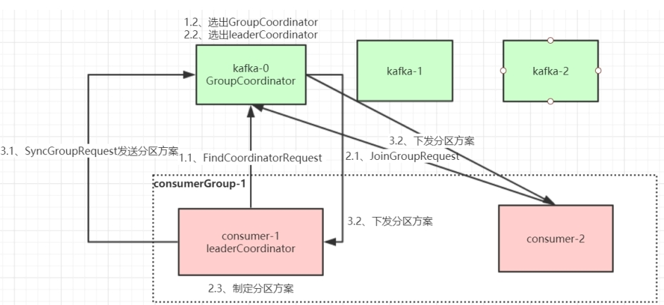
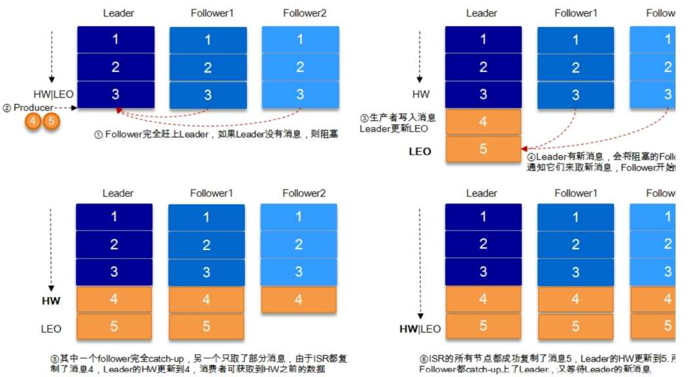

## MQ 

#### 使用场景
- 应用解耦：提高系统容错性和可维护性
- 异步提速：提升用户体验和吞吐量
- 削峰：提高系统稳定性
- 缺点
  - 可用性降低（引入中间件）
  - 系统复杂性提高（消息丢失）
  - 消息一致性（消息重复）
####Rabbitmq
- 组成
  - 生产者、虚拟机、交换机、消费者
- amqp协议 erlang开发
- 简单模式：一个生产者，一个消费者
- 工作队列模式：一对多消费者
- 发布订阅模式：增加了交换机，消息发送到交换机。由交换机转发给队列。需要设置交换机与队列绑定
  - Routing 模式要求队列在绑定交换机时要指定 routing key，消息会转发到符合 routing key 的队列。
  - Topic 主题模式可以实现 Pub/Sub 发布与订阅模式和 Routing 路由模式的功能，只是 Topic 在配置routing key 的时候可以使用通配符，显得更加灵活。
- 生产者
  - confirm
    - ack表示消息被broker接收，
    - nack表示broker拒收，（队列已满、io、限流等）
  - return表示消息被正常ack后，但broker没有对应的队列进行投递时，消息退回给生产者
    - 参数设置成true
    - 到达不了队列回调
- 消费者
  - 自动ack
  - 手动ack
- 消费端限流 ：设置prefetch每次拉取条数（手动ack）
- 成为死信
  - 到期
  - 队列满
  - 消费者拒绝接收，并且不重回回队列
  - 超时未被消费
- 当消息成为死信后，如果该队列绑定了死信交换机，则消息会被死信交换机重新路由到死信队列
- TTl+死信队列实现延时队列

- 消费堆积
  - 消费者宕机
  - 消费能力不足
  - 发送量大
  - 
- 方案
  - 上线更多的消费者
  - 批量读取
#### Rocketmq（只有java客户端） master主节点，slave只负责备份，不处理请求
- 组成
  - nameserver注册中心
  - broker实例，主从
  - producer
  - consummer
- 发送方式
  - 单向（发送后就不再关注），无返回值
  - 异步（mq处理完请求会进行回调）
  - 同步（发送完等待响应）
- 消费
  - 主动拉（新旧两种，旧的方法自己管理offset，目前使用）
  - 推
  - 顺序消息（底层通过加锁syncronize）
    - 只能保证局部有序
      - 购买、付款、奖励
  - 延迟消息（开源版只能设置固定的几个值），底层通过发往另外一个topic，定时取消息发送（会用到CAS，保证只有一个线程拉取）
  - 批量发送 （消息体大小1~4M），不能是延迟、事务消息
  - 过滤消息（一个topic多个tag，把过滤上推至broker，不满足条件的不在推送。支持生产、消费的sql过滤）
  - 事务消息，只和发送者有关 默认回查15次（性能会有所下降）
    - 本地事务与消息的一致性
    - 只能保证分布式事务的一部分
- ACL
- 消息轨迹
  - 生产、消费端开启
#####  Rocketmq 概念
- topic分片存储于不同的broker
- 生产者组：事务回查机制中需要找到生产者
- broker集群
  - 低版本不支持高可用，4.5.0以后才支持
  - Dledger高可用集群，每个节点的id都是-1
    - 接管broker的Commitlog消息存储
    - 从集群中选举master（raft算法）
      - leader，follower，candidate（没有leader时都是candidate）
      - termid，myid。类似zookeeper
      - 一轮未选举出leader时，会随机休眠再次选举
    - 完成master节点往slave节点的消息同步
- namesrever 注册中心，相互之间无通信
- 配置删除消息时间

#### 消息存盘
- 磁盘顺序写
- 零拷贝
  - mmap，内存映射，rocketmq采用机制
  - sendfile
- commitlog 生产者发的消息
- consummerqueue 消费逻辑队列
- 索引文件
- 刷盘
  - 同步
  - 异步，先刷cache，再落盘（每个500ms）
- 负载均衡
  - 生产者：轮询
  - 消费者
    - 集群模式 queue与对应的consummer建立长连接
      - 平均分
      - 轮询分
    - 广播模式
- 消息重试 默认16次 间隔时间逐渐加长
- 将超过重试阈值的消息发往默认创建的死信队列
- 一个死信队列对应一个消费者组
- 私信队列默认禁读禁写
- 消息幂等
- #### kafka（分区，区别于其他mq）
- 分布式，支持多分区，多副本基于zookeeper协调的消息系统
- 消息 默认保留一周
  - 单播 每个消息只能被消费者组中的一个消费者消费
  - 多播 把消费者放到不同的消费者组
  - offset以消费者组为单位
  - topic 逻辑单元
    - partition分区，每个分区对应一个commitlog，message按顺序存储在commitlog中，有一个唯一标识（partition内）
    ，即offset
  - 消费者offset由消费者维护
  - Kafka中的Producer和Consumer采用的是Push-and-Pull模式，即Producer向Broker Push消息，Consumer从Broker Pull消息
    - Pull模式的一个好处是consumer可以自主决定是否批量的从broker拉取数据。
    - Pull有个缺点是，如果broker没有可供消费的消息，将导致consumer不断在循环中轮询，直到新消息到达。
  - 副本：主副本，从副本，收发都有主副本负责
  - ISR：存活并且和主副本保持通信的副本节点
  - 一个分区只能被同一消费者组的一个消费者消费，但是可以被别的组消费者同时消费
  - producer发送的时候分区策略，可以实现org.apache.kafka.clients.producer.Partitioner接口自定义分区策略，并进行属性配置
    - 新版本默认轮询策略（未指定partition以及key），发往可用分区，老版本随机策略
    - 按消息键保序策略（指定key），发往所有分区
  - 发送本身是异步的，但是会返回一个future对象，调用get就变为同步
  - 也可以发送时设置callback
  - 消费者消费策略
    - 默认，也叫轮循，说的是对于同一组消费者来说，使用轮训分配的方式，决定消费者消费的分区
    - Range：对一个消费者组来说决定消费方式是以分区总数除以消费者总数来决定，一般如果不能整除，往往是从头开始将剩余的分区分配开
    - Sticky：保留现有消费者原来的消费策略，将退出的消费者所消费的分区平均分配给现有消费者，新增消费者同理，同其他现存消费者的消费策略中分离
  - 发送方式
    - 同步
    - 异步，有回调
- 高性能
  - 机械硬盘顺序读写堪比ssd随机读写，千兆网卡需要除以8（？）
  - 传统的 IO 流程，需要先把数据拷贝到内核缓冲区，再从内核缓冲拷贝到用户空间，应用程序处理完成以后，再拷贝回内核缓冲区
  - 零拷贝 为了减少不必要的拷贝，Kafka 依赖 Linux 内核提供的 Sendfile 系统调用，在 Sendfile 方法中，数据在内核缓  
  冲区完成输入和输出，不需要拷贝到用户空间处理，这也就避免了重复的数据拷贝。Kafka 把所有的消息都存放在单独的文件里，在消  
  息投递时直接通过 Sendfile 方法发送文件，减少了上下文切换，因此大大提高了性能
  - Producer生产的数据持久化到broker，采用mmap文件映射，实现顺序的快速写入
    - Kafka 使用 Memory Mapped Files 完成内存映射，Memory Mapped Files 对文件的操作不是 write/read，而是直接  
    对内存地址的操作，如果是调用文件的 read 操作，则把数据先读取到内核空间中，然后再复制到用户空间，但 MMAP可以将文件  
    直接映射到用户态的内存空间，省去了用户空间到内核空间复制的开销
  - Customer从broker读取数据，采用sendfile，将磁盘文件读到OS内核缓冲区后，直接转到socket buffer进行网络发送。
  - kafka不会修改也不会删除文件，保证了顺序读写
  - 批量发送读取，数据压缩
  - 分区机制
    - kafka中的topic中的内容可以被分为多partition存在，每个partition又分为多个段segment，所以每次操作都是针对一小部分做操作，很轻便，并且增加并行操作的能力
- kafka集群中有一个或者多个borker，其中一个broker会被选举为controller
- cotroller作用
  - 当某个分区主副本出现故障时，由它负责选举新的主副本
  - 当检测到某个分区的ISR出现变化时，也由它通知所有的broker更新元数据
  - 当为某个topic增加分区时，同样也由它负责让新分区为其他节点感知到
- controller选举机制
  - 集群启动时会向注册中心创建controller节点，zookeeper能保证只有一个broker能创建成功
  - 创建成功的broker成为controller
  - cotroller出现故障时，同样经过上边的步骤选举出新的controller
- partition副本的选举机制
  - controller节点感知到leader副本出现故障后，会从ISR中那第一个副本作为主副本
    - 因为第一个是被最先放进ISR的，理论上同步的数据最新
    - 如果设置了ISR副本都挂以后可以从外部选leader，虽然可以提高可用性，但是选出的主副本可能同步的数据不是最新
    - 进入ISR的条件
      - 副本能复制leader副本上的写操作，并且不能落后太多。如果连续超过设置的同步时间（默认值是10秒）没有和主副本同步过一次的话，会被移出
      ISR
      - Follower副本唯一的工作就是不断地从Leader副本拉取消息，然后写入到自己的提交日志中。若该副本后面慢慢地追上了Leader的进度，那么它是能够重新被加回ISR的
- 生产端消息的幂等
  - producer幂等
    - 通过在生产端添加开启幂等的配置
    - Producer 每次启动后，会向 Broker 申请一个全局唯一的 pid。（重启后 pid 会变化，这也是弊端之一）
    - 针对每个 <Topic, Partition> 都对应一个从0开始单调递增的 Sequence，同时 Broker端会缓存这个 seq num
    - 拿 <pid, seq num> 去 Broker 里对应的队列ProducerStateEntry.Queue（默认队列长度为 5）查询是否存在
      - 如果 nextSeq == lastSeq + 1，即 服务端seq + 1 == 生产传入seq，则接收。
      - 如果 nextSeq == 0 && lastSeq == Int.MaxValue，即刚初始化，也接收。
      - 反之，要么重复，要么丢消息，均拒绝。
    - 解决了重复和乱序
  - 那什么时候该使用幂等：
    - 如果已经使用 acks=all，使用幂等也可以。
    - 如果已经使用 acks=0 或者 acks=1，说明你的系统追求高性能，对数据一致性要求不高。不要使用幂等。
  - kafka事务，解决producer幂等的弊端：单会话且单分区幂等。
    - 写入之前开启事务，写入异常时终止事务
    - 消费端要进行配置只会读取事务型 Producer 成功提交事务写入的消息。当然了，它也能看到非事务型 Producer 写入的所有消息。
  - 消费幂等
    - 使用消息表，消费的时候开启事务将消息id存入消息表，再进行业务处理
    - 当有重复时消息表插入异常触发事务回滚
- 顺序消费
  - kafka的topic是无序的，但是一个topic包含多个partition，每个partition内部是有序的。
  - 可以设置topic，有且只有一个partition
  - 要保证生产者写消息时，按照一定的规则写到同一个partition，不同的消费者读不同的partition的消息，就能保证生产和消费者消息的顺序。
  - 消费者内部根据线程数量创建等量的内存队列，对于需要顺序的一系列业务数据，根据key或者业务数据，放到同一个内存队列中，然后线程从对应的内存队列中取出并操作
- 消息堆积
  - 减小消息体的大小，减少io耗时
  - 消息体包含关键字段，其他信息通过接口获取
  - 多线程处理消息对应的业务
- 分区数据倾斜
  - 采用更合理的字段作为路由字段
- 消息丢失
  - producer：
    - 用带回调通知函数的方法进行发送消息，即 Producer.send(msg, callback), 这样一旦发现发送失败， 就可以做针对性处理。
    - ACK 确认机制，-1/all 表示有多少个副本 Broker 全部收到消息，才认为是消息提交成功的标识。
    - （分区副本的个数）replication.factor >= 2   （消息至少要被写入成功到 ISR 多少个副本才算"已提交"）min.insync.replicas > 1
    - 重试次数 retries：
    - 重试间隔时间 retry.backoff.ms：
  - broker
    - unclean.leader.election.enable：有哪些 Follower 可以有资格被选举为 Leader
  - consummer
    - 拉取数据、业务逻辑处理、提交消费 Offset 位移信息。
- 消费者消费消息的offset机制
  - consumer会定期将自己消费的offset提交给内部的topic：_cosumer_offset,提交的时候key为consumerGroupId+topic+分区号  
  ，value就是当前offset。kafka会定期清理_consumer_offsets里的offset，保留最新的那条
  - kafka默认给_consumer_offsets设置50个分区，可以通过加机器提高并发
- rebalance机制：当消费者组或者消费者分区发生变化时，会发生rebalance。只针对未指定分区的消费。rebalance过程中消费者不能进行  
消费
  - 消费者组消费者变化
  - 动态给topic增加了分区
  - 消费者组订阅了更多的分区
- 消费者
  - Consumer 在每次调用 Poll() 消费数据的时候，顺带一个 timeout 参数，当返回空数据的时候，会在 Long Polling 中进行阻塞，等待 timeout 再去消费，直到数据到达。
- rebalance过程
- [coordinator](https://mp.weixin.qq.com/s/dOiNT0a_dRytwatzdrJNCg).
  - consumergroup会选择一个broker作为组协调器，来监控消费组成员的心跳以及判断是否宕机，然后开启rebalance，消费组成员启动的时候  
  会向集群的某个节点发送findCondinatorRequest请求来找到组协调器并建立网络连接
    - consumer offset提交分区：consumerGroupId+topic+分区号，该分区的主副本所在的broker即为组协调器
  - 消费者发起joinConsumerGroup请求，第一个加入到gruop的被选为消费组协调器（leader），把consumer group的情况发送过去，由它制定分区方案
  - 消费组协调器制定好分区方案后发送给组协调器，心跳检测时由组协调器发送给各个消费者，他们会根据指定分区的leader broker进行网络连接及消息消费
- rebalance策略
- 三种策略
  - range 默认  
  RangeAssignor 是 Kafka 默认的分区分配算法，它是按照 Topic 的维度进行分配的，对于每个 Topic，首先对 Partition 按照分区ID进行排序，
 然后对订阅这个 Topic 的 Consumer Group 的 Consumer 再进行排序，之后尽量均衡的按照范围区段将分区分配给 Consumer。此时可能会造成先分配分区的  
  Consumer 进程的任务过重（分区数无法被消费者数量整除）。
  - round_robin
    - RoundRobinAssignor 的分区分配策略是将 Consumer Group 内订阅的所有 Topic 的 Partition 及所有 Consumer 进行排序后按照顺序尽量均衡的  
    一个一个进行分配。如果 Consumer Group 内，每个 Consumer 订阅都订阅了相同的Topic，那么分配结果是均衡的。如果订阅 Topic 是不同的，  
    那么分配结果是不保证“尽量均衡”的，因为某些 Consumer 可能不参与一些 Topic 的分配。
  - sticky
    - 初始分配与round_robin类似
    - rebalance时
      - 分区分配尽可能均匀
      - 尽可能与上次的分配保持一致
      - 当冲突时，第一个目标优先于第二个目标
- producer发布消息
- 
  - push方式推给broker，apeend到partion中，顺序写磁盘
  - partition选择方式
    - 指定partition
    - 未指定partition但制定了key，通过对key的value hash选择partition
    - 都未指定，轮询
- 消息写入流程 
- 
  - producer找到partition的leader发送消息
  - leader写入本地log
  - follower从leader拉取消息写入本地log发送ack
  - leader收到ISR中所有follower的ack后增加HW(高水位，最后commit的offset)，并向producer发送ack
  - 既不会像同步复制那样影响吞吐率，有也不会像异步那样丢数据
  - HW(水位)和LEO(log_end_offset)
    - partion的ISR中最小的LEO作为HW,consumer最多消费到HW位置，每个副本都有HW，有其自身维护。新写入leader的  
    消息不能被消费者消费，需要等到ISR中所有副本都更新完HW并且自己也更新过HW后才能被消费。对于来自内部broker的读请求  
    没有HW的限制
- 
- 日志分段存储
  - 一个分区的消息存储在topic+分区号文件夹下，消息在分区内是分段存储的，每个段的消息存储在不同的log里，一个段位  
  的log文件最大为1G，方便加载到内存
  - offset索引文件：kafka每发4K（可配置）的消息就会记录一条当前消息的offset到index文件中
  - 时间索引文件：kafka每发4K（可配置）的消息就会记录一条当前消息发送的时间戳和offset到timeindex文件中
  - 一个日志段文件满了就会开启一个新的日志段文件