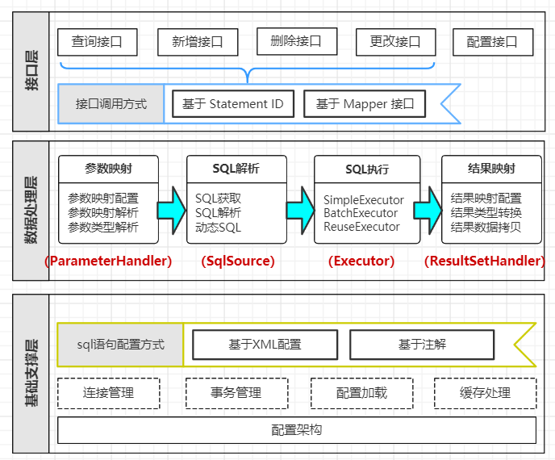

  
## Mybatis

#### mybatis 半自动化orm框架，因为更换数据库需要修改配置。全自动：herbernate
- Spring启动过程中，大致会经过如下步骤去生成bean
  - 扫描指定的包路径下的class文件
  - 根据class信息生成对应的BeanDefinition
  - 在此处，程序员可以利用某些机制去修改BeanDefinition
  - 根据BeanDefinition生成bean实例
  - 把生成的bean实例放入Spring容器中

- 整合mybatis
  - 定义要扫描的包路径
    - @MapperScan(basePackages = {"com.tuling.mapper"})
  - MapperScan通过import引入MapperScannerRegistrar，继承了ImportBeanDefinitionRegistrar
    - 会在配置类解析的时候调用registerBeanDefinitions方法注册一个MapperScannerConfigurer，实现了BeanDefinitionRegistryPostProcessor
    - 调用实现了BeanDefinitionRegistryPostProcessor的postProcessBeanDefinitionRegistry方法时会利用重写的ClassPathMapperScanner扫描指定的包
    - 调用父类ClassPathBeanDefinitionScanner 来进行扫描获取bean定义
    - 然后循环bena定义将类型修改为MapperFactoryBean
    - 设置ConstructorArgumentValues 会通过构造器初始化对象，会在实例化MapperFactoryBean时将我们的mapper的class传进去
    - 最终调用getBean实例化时会根据这个传进来的class生成代理对象，注册到容器中，完成mapper接口的注入
  - 
- 将全局配置文件解析成Configration对象（只会加载一次，重复加载抛异常），解析全局配置文件的内容（property、setting、插件、  
类型处理器（会维护默认的）、mapper（指定包、指定路径等方式进行配置）等）。
  - mapper解析：namespace、缓存、resultmap、parameter、sql片段等，sql片段封装到mappersatatement的sqlsorce。二级缓存由  
  多个缓存实现类装饰而成，通过责任链调用方式实现增强（装饰器：动态扩展）。装饰器  
  更注重增强，代理类更注重隐藏被代理对象
    - 解析sql，如果是查询不刷新缓存，增删改默认执行后刷新缓存 
    - sql被解析成一个个sqlnode，封装成责任链。调用的时候利用责任链的模式调用，将每一个sqlnode解析方式追加到sql变量中
    - 使用处理器对参数、返回结果映射等进行参数解析
- 然后创建SqlSessionFactory（简单工厂和构造器模式），然后获取到sqlsession
- sqlsession调用执行器（默认使用SimpleExecutor）进行crud操作  
  - 如果开启了缓存，会将SimpleExecutor进行缓存执行器的装饰
- Executor执行增删查改的时候，如果使用了缓存，会先从二级缓存中取即调用query（此方法利用责任链的模式调用，将每一  
个sqlnode解析方式追加到sql变量中），取不到调用CachingExecutor的代理SimpleExecutor，SimpleExecutor  
代理没有实现query，又会调用BseExecutor，调用具体的实现获取结果。生成缓存key放入缓存（前提是开启缓存）
执行完关闭session
- MyBatis 允许你在已映射语句执行过程中的某一点进行拦截调用。默认情况下，MyBatis 允许使用插件来拦截方法的调用。即
插件增强。利用动态代理生成插件的代理对象，将代理封装到责任链中，然后对Executor、ParameterHandler、ResultSetHandler、StatementHandler  
进行增强。
- 插件增强：动态代理和责任链实现。调用相关组件的时候，会进行插件拦截，进行责任链调用代理对象进行增强
- sql被解析成一个个sqlnode，然后利用责任链的模式调用，将每一个sqlnode解析方式追加到sql变量中  
，执行的时候这些解析方式会将sqlnode结成能执行的sql语句
- 二级缓存：责任链+装饰器模式。由多个缓存实现类通过装饰器模式装饰组成，通过责任链调用方式实现（装饰器：动态扩展）

