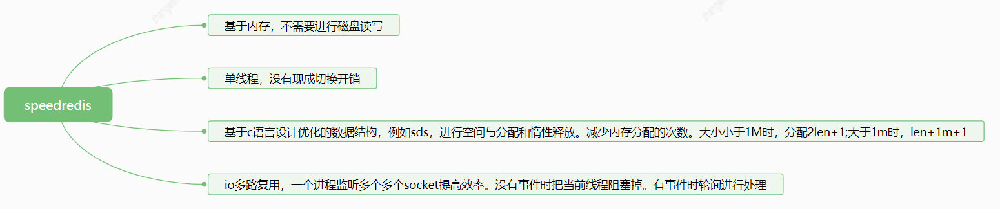

>1. java虚拟机  
    1. jvm内存区域划分  
    2. 对象重创建到回收的整个过程  
    3. 垃圾回收算法  
    4. 垃圾回收器（新生代和老年代），常用组合  
  
    
>2. mysql  
    1. 索引  
    2. 索引类型  
    3. 四种隔离级别（默认哪种）  
    4. mvcc （当前读 快照读）  
    5. undolog redolog binlog  
    6. 刷页  
    7. 事务特性  
  
    
>3. 锁  
    1. syncronized  
    2. reentrantlock  
    3. AQS    
    4. volatile  
    5. 锁类型（公平 非公平 重入  悲观 乐观 共享 独享）  
    
      
>4. redis（特点）    
    1. 数据类型  
    2. 数据结构  
    3. AOF RDB  
    4. 雪崩 击穿 穿透  
    5. 主从以及集群    
    6. redis为什么快   
    

      
  
>5. Map  
    1. HashMap  
    2. ConcurrentHashMap  
  
    
>6. spring  
    1. Bean的生命周期  
    2. AOP IOC  
    