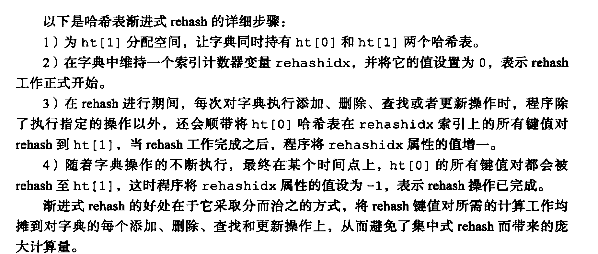
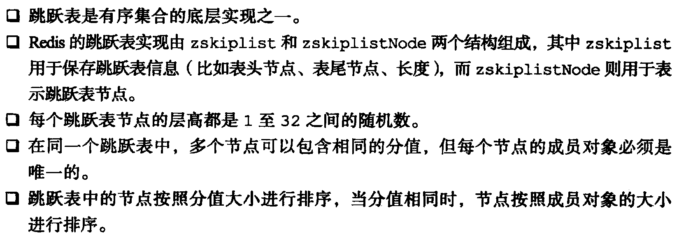

## Redis

#### 使用场景
[使用场景](https://mp.weixin.qq.com/s/u0nP4pV3mlbfsbzuLFkYOg).
- string 自增（incre）、分布式锁（setnx）、seesion共享、
  - setnx非原子操作，使用set+失效时间
  - 防止释放错锁，value存唯一标识，释放时比较，保证原子性可以用lua脚本实现
  - Redisson 的宗旨是促进使用者对 Redis 的关注分离（Separation of Concern），从而让使用者能够将精力更集中地放在处理业务逻辑上。
  - Redisson 是一个在 Redis 的基础上实现的 Java 驻内存数据网格
  - [Redisson](https://mp.weixin.qq.com/s/HkLPEURcJGc25shySaZbuA).
- hash  购物车 过期功能不能用在field上，只能用在key上。集群规模不适合使用，会造成数据倾斜
- list 栈（lpush+lpop） 队列（lpush+rpop） 阻塞队列（lpush+brpop）
- set 抽奖用户、点赞、关注模型、电商商品筛选
- 有序集合 排行榜
#### 单线程的高性能
- 基于内存
- 执行命令单线程，持久化、快照等是多线程
- I/O多路复用
- Redis 的线程模型：基于Reactor模式开发了自己的网络事件处理器，即文件时间处理器

  - Redis 内部使用文件事件处理器 file event handler ，这个文件事件处理器是单线程的，所以 Redis 才叫做单线  
  程的模型。它采用 IO 多路复用机制同时监听多个 socket，将产生事件的 socket 压入内存队列中，事件分派器根据 socket 上的事件类型来选择对应的事件处理器进行处理。
  - 文件事件处理器的结构包含 4 个部分： 
    - 多个 socket 
    - IO 多路复用程序 
    - 文件事件分派器 
    - 事件处理器（连接应答处理器、命令请求处理器、命令回复处理器） 
    - 多个 socket 可能会并发产生不同的操作，每个操作对应不同的文件事件，但是 IO 多路复用程序会监听多个 socket，会将产生事件的 socket  
    放入队列中排队，事件分派器每次从队列中取出一个 socket，当被监听的socket准备好执行连接应答、读取、写入、关闭等操作时，与操作对应文件事  
    件就会产生，这时文件事件处理器就会调用之前关联好的事件处理器来处理这些事件。实现了高性能的网络通信模型  
    socket 的事件类型交给对应的事件处理器进行处理。
#### redis持久化
- 持久化：RDB
  - save同步方式，不消耗内存
    - Redis 将内存数据库快照保存在名字为 dump.rdb 的二进制文件中。
    - N 秒内数据集至少有 M 个改动 这一条件被满足时， 自动保存一次
      数据集。
    - 也可以手动，执行命令save或bgsave
    - 每次命令执行都会将所有redis内存快照到一个新的rdb文件里，并覆盖原有rdb快照文件
  - bgsave异步方式（默认）,同时fork子线程利用写时复制技术将bgsave期间客户端的请求数据同时也写进rdb文件
    - bgsave 子进程是由主线程 fork 生成的，可以共享主线程的所有内存数据。bgsave 子进程运行后，开始读取  
    主线程的内存数据，并把它们写入 RDB 文件。，如果主线程要修改一块数据，那么，这块数据就会被复制一份，生成该  
    数据的副本。然后，bgsave 子进程会把这个副本数据写入 RDB 文件，而在这个过程中，主线程仍然可以直接修改原来的数据
  - 机器宕机会丢失部分数据丢失 。最近写入、且仍未保存到快照中的那些数据。
- 持久化AOF  将修改的每一条指令记录进文件appendonly.aof中(先写入os cache，每隔一段时间 fsync到磁盘)
  - append 将修改命令写进AOF文件（先写入oscache，每隔一段时间fsync写磁盘）
  - fsync三种策略
    - 每次有命令追加AOF时就执行一次fsync，非常慢也非常安全
    - 每秒fsync，只会丢失一秒数据（默认）
    - 从不fsync，将操作交由操作系统处理。快，但不安全
- AOF重写（fork子线程） AOF文件里可能有太多没用指令，所以AOF会定期根据内存的最新数据生成aof文件
  - 文件大小达到设置阈值
  - 自从上次重写后增长达到设置百分比时
  - AOF还可以手动重写，进入redis客户端执行命令bgrewriteaof重写AOF
- 我们很少使用 RDB来恢复内存状态，因为会丢失大量数据。我们通常使用 AOF 日志重
  放，但是重放 AOF 日志性能相对 RDB来说要慢很多，这样在 Redis 实例很大的情况下，启动需要花费很长的时间。
  - 恢复数据时优先使用AOF恢复，数据更全
- redis4.0 混合持久化
  - 默认关闭 
  - AOF重写时，不会单存将内存数据转换为命令写入AOF文件，而是将重写这一刻之前的内存做RDB快照处理，并且RDB快照  
  内容和增量AOF修改内存数据的命令存在一起，都写入AOF文件，新的文件一开始不叫appendonly.aof，重写完成后文件改名、  
  覆盖原有AOF文件，完成新旧文件的替换。于是机器重启的时候可以先加载RDB的内容，然后重放增量的AOF日志就可以完全取代  
  之前的AOF全量文件重放，重启效率提升
- 备份策略
  - 定时调度脚本，将AOF或者RDB文件备份到一个目录，保留最近48小时数据
  - 每天保留当天数据到一个目录，保留最近一个月
  - 每次复制备份的时候，把太旧的数据删除
  - 每天晚上将当前机器上的备份复制一份到其他机器或者云盘
#### 主从
- 单节点内存配置一般小于10g,有局限
- 主从架构
- master 默认每隔 10 秒发送一次 heartbeat，slave node 每隔 1 秒发送一个 heartbeat。
  
- 原理
  - 给master配置一个slave，无论是否第一次连上slave，都会向master发送一个PSYNC命令给master请求复制数据
  - master收到命令后在后台进行数据持久化通过bgsave生成rdb文件，持久化期间master会继续接收客户端的请求，并将这些  
  可能修改数据集的命令缓存在内存。
  - 持久化完成后将rdb数据集文件发给slave，slave将接收到的文件持久化生成rdb文件，然后加载到内存。然后master将缓存到内存的  
  命令发给slave
  - 当由于某些原因断开连接时，slave能自动重连master。如果master收到多个slave并发连接请求，只会进行一次持久化而不是一次  
  一个连接一次。最后把数据发给多个并发连接的slave
      
- 断点续传2.8版本开始
  - master会在内存中创建一个复制数据用的缓存队列，缓存最近一段时间的数据，master和它所有的slave都维护了复制数据的offset和master  
  的进程id，因此断开重连时会从记录的数据下标开始。如果master进程id没了或者节点数据下标太久已经不再master的缓存队列了，那么会进行一  
  次全量复制
      
- 为了防止从节点过多，缓解主从复制风暴（多从节点从主节点复制数据，造成主节点压力过大），做如下架构  
- slave 不会过期 key，只会等待 master 过期 key。如果 master 过期了一个 key，或者通过 LRU 淘汰了一个 key，那么会模拟一条 del 命令发送给 slave。
    
- Redis 的高可用架构，叫做 failover 故障转移，也可以叫做主备切换。通过哨兵实现
- #### 哨兵
- 集群监控：负责监控 Redis master 和 slave 进程是否正常工作。
- 消息通知：如果某个 Redis 实例有故障，那么哨兵负责发送消息作为报警通知给管理员。
- 故障转移：如果 master node 挂掉了，会自动转移到 slave node 上。
- 配置中心：如果故障转移发生了，通知 client 客户端新的 master 地址。
- 哨兵至少需要 3 个实例，来保证自己的健壮性。
- 哨兵 + Redis 主从的部署架构，是不保证数据零丢失的，只能保证 Redis 集群的高可用性。
- 数据丢失
  - 因为 master->slave 的复制是异步的，所以可能有部分数据还没复制到 slave，master 就宕机了，此时这部分数据就丢失了。
  - 脑裂导致的数据丢失、
    - 某个 master 所在机器突然脱离了正常的网络，跟其他 slave 机器不能连接，但是实际上 master 还运行着。此时哨兵可能  
    就会认为 master 宕机了，然后开启选举，将其他 slave 切换成了 master。这个时候，集群里就会有两个 master ，也就是所谓的脑裂。
    - 此时虽然某个 slave 被切换成了 master，但是可能 client 还没来得及切换到新的 master，还继续向旧 master 写数据。  
    因此旧 master 再次恢复的时候，会被作为一个 slave 挂到新的 master 上去，自己的数据会清空，重新从新的 master 复制数据。而新的 master 并没有后来 client 写入的数据，因此，这部分数据也就丢失了。

- 哨兵架构
  
- 哨兵节点是特殊的redis服务，不提供读写功能，主要用来监控redis实例节点（Raft算法选举）
- 一般情况下sentinel以每10s一次的频率向被监视的主服务器和从服务器发送INFO命令获取信息，当主服务器处于下线状态或者正在对主服务器进行故障转移  
时，改为每秒一次
- 对于监视同一主服务器和从服务器的sentinel来说，他们以每两秒一次的频率向被监视服务器的_sentinel_:hello频道发送消息来向其他sentinel宣示自  
己的存在
- 每个sentinel也会订阅该频道
- 每个哨兵还会跟其他哨兵交换对 master 的监控配置，互相进行监控配置的同步。
- sentinel只会与主从建立命令连接和订阅连接，sentinel之间只会创建命令连接
- sentinel以每秒一次的频率向其他所有实例发送PING命令，根据回复情况判断是否主观下线
- 当sentinel讲一个主服务器视为主观下线时，会向其他sentinel发起询问，询问是否同意主管下线
- 当收到足够多的主管下线投票后，会将主服务器判断为客观下线，并发起一次真对主服务器的故障转移操作
- 客户端第一次通过哨兵找到redis主节点，后续直接访问主节点。当主节点发生变化时，哨兵节点会第一时间感知到并通知给客户端（客户端一般实现了  
订阅功能）
#### 集群
- 将所有数据划分为16384个slot，每个实例分配以部分slot。当客户端建立连接时，会将槽位信息缓存到本地。请求时利用crc16算法取到hash值，然  
后对16384取模得到具体槽位
- 跳转重定位：当客户端像一个错误的实例节点发送请求时，该节点发现key所在槽位并不归自己管理。他会向客户端发送一个特殊的跳转指令携带目标节点的  
地址，客户端收到指令后会跳转到正确的节点并更新本地槽位缓存信息
- 节点间通信协议：gossip，
  - 维护集群的元数据（集群节点、主从角色、节点数量，、各节点共享的数据）有两种方式
    - 集中式元数据更新、读取时效性比较好，一旦数据变更会立刻更新到集中式的存储中，其他节点读取的时候立即就可以感知到。但是元数据的更新压力  
    都集中在一个地方，可能导致元数据的存储压力。很多中间件都会借用zookeeper做集中式存储元数据
    - gossip协议包含多种信息，ping、pong、meet、fail等。
      - 元数据的更新比较分散，不是集中在一个地方。更新请求会陆陆续续达到所有节点上。有一定的延迟，降低了压力。可能会导致一些操作滞后
- 选举：
  - slave发现自己的master变为fail
  - 将自己记录的currentEpoch+1并广播FAILOVER_AUTH_REQUEST 信息
  - 其他节点收到信息后，只有master能回复，判断合法性，并发送FAILOVER_AUTH_ACK。对每一个eporch只发送一次ack
  - 尝试failover的salve收到ack
  - 收到超过半的master的ack的slave成为新的master
  - slave广播pong消息通知其他节点
  - slave并不是一感知到fail就发起选举，而是有一定延迟。从master复制的数据越新，延迟的时间越短，保证持有最新数据的slave首先发起选举
- 哨兵选举：也是过半原则
#### lua脚本&管道
- 管道：批量操作，不是原子的。一个操作命令失败不会影响其他命令的执行
- lua
  - 减少网络开销：五次网络请求可以用一个请求完成
  - 原子操作，一个脚本作为一个整体执行，中间不会有别的命令插入。
  - 替代redis的事务功能
  - 不要lua脚本中出现死循环和耗时的操作，否则会造成redis阻塞
####数据结构
- 数据结构类型
  - sds（简单动态字符串 ）
  - 双端链表
  - 字典
  - 压缩表
  - 跳跃表
  - 整数集合
- 对象类型 基于以上数据结构创建的对象系统
  - 字符串对象
    - string sds 只扩不减  
    - 常数复杂度获取字符串长度
    - 二进制安全
    - 内存预分配,避免频繁的内存分配
      - len 现有字符串占用长度
      - free 空闲长度 当字符串变更长度不够用时，会将字节数组扩增到（len+所缺长度）*2
      - 当长度达到1M时，每次扩展1M
    - 兼容C语言函数库（自动添加\0）
    - 惰性空间释放：缩短后并不会立即回收，而是将长度先加到free属性上
      - 保存的是整数值，并且可以用long类型来表示，底层使用int编码
        
      - 保存的字符串，长度大于32，使用raw编码
        
        - redisobject和sdshdr分开存储，需要两次内存分配
      - 字符串小于等于32，使用embstr编码
        
        - redisobject和sdshdr在一块连续内存
        - redis没有为embstr提供修改程序，需要先转换为raw字符串再进行修改
  - 列表对象
    
    - 压缩表 每个节点记录前一节点的长度
      - 保存的字符串，且元素长度都小于64
      - 元素数量小于512
    
    - 双端链表
      - 不能满足以上条件的都需要使用双端链表
  - 哈希对象
    
    - 压缩表
      - 所有键值对的键和值的字符串长度都小于64
      - 键值对数量小于512
    
    - 字典
      - 不满足以上条件
      - 
  - 集合对象
  
    - intset
      - 集合对象都是整数值
      - 元素数量不超过512
    - hashtable
  - 有序集合对象
   
  
    - 压缩列表
      - 所有元素成员的长度都小于64字节
      - 元素数量少于128
    
    -字典和跳跃表 
      - 字典保存元素和分值的映射
      - 跳跃表按分值大小保存了集合元素
      - 
- 默认16个Db hash桶长度默认4 2倍扩容
- key过多时会引发rehash
- 先访问0，存在将整个hash桶搬到1，不存在访问1.
- bitmap：key offset value 2的32次方-1
  - offset即为value在bitmap中的位置，默认为0，当存储的数据offset不连续、且间隔较大时，会浪费空间。因为会按offset最大的那个  
  去申请空间
  - 日活（或操作）、连续登陆（与操作）
- list 采用双端链表和ziplist来作为底层实现  
- hash 当数据量比较少或者单个元素比较小时时，底层为ziplist；数据量大时为字典 
  - 不能对内层key设置过期时间  
  - 当zipliist元素个数查过512
  - 单个元素大小超过64byte
- set value为null的dict。
  - 当数据可用整形表示时，被编码为intset
  - hashtable，以下条件任意满足
    - 元素个数大于设置 
    - 元素无法用整型表示
- zset dict+skiplist 
  - 跳表：建立索引层 时间复杂度logn 空间换时间
  - 层高：随机算法，效果和二分法得到的层高差不多
- GEOhash经纬度编码

#### 缓存失效（击穿）、穿透、雪崩
- 击穿：热点key在扛大量请求，失效失效瞬间，请求直达数据库。
  - 不设置失效时间，或者限流，查询数据源时加锁串行
- 穿透：缓存空对象
  - 自身业务代码逻辑问题请求直达数据库
  - 恶意攻击、爬虫造成大量空命中请求直达数据库
- 雪崩：大量key失效，数据查询回源，导致数据库宕机
  - 失效时间在基数上随机
  - 限流熔断并降级
  - 提前演练
- 热点缓存key的重建优化
  - 分布式锁保证只有一个线程能重构
- 双写不一致
  - 加过期时间
  - 串行执行
  - 延时双删：删除后睡眠一段时间再删除一次
  - 分布式锁串行，redission读写锁
  - canal中间件监听binlog（引入中间件，增加了复杂性）
- 缓存适合读多写少，加入缓存提高性能，如果写多读多又容忍不了数据不一致，那就没必要用缓存，直接操作数据库。缓存是和对实时性、一致性  
要求不是太高的数据
- key设计
  - 可读性
  - 简洁性
  - 不含特殊字符
- value设计
  - 拒绝bigkey
    - 字符串：单个value大于10kb
    - 哈希、集合、列表、有序集合等：元素过多（超过5000）
    - 渐进删除：hscan、sscan、zscan等
    - 危害：
      - 导致redis阻塞（执行慢，阻塞其他客户端请求）
      - 网络拥塞：带宽有限，导致请求发不过去
    - bigkey过期删除：配置异步删除
- redis事务比较弱，使用lua脚本
- 删除策略
  - 被动：当读一个key时，key已经过期就会进行删除
  - 主动：由于被动删除无法保证冷数据被及时删除，所以redis会定期删除一批已过期的key
  - 当使用内存超过限制时，会触发主动清理策略
  - 主动清理策略
    - 针对设置了过期时间的key    
      - 在筛选时，针对有过期时间的key，优先删除过期早的key
      - 在设置了过期时间的key中随机删除
      - 使用lru策略：删除最近最少使用。以最近一次访问时间为准
    - 针对所有key
      - 从所有key中随机选择
      - lru
    - 不处理
      - 不删除数据，内存不足时拒绝所有写入操作并返回错误信息
- 默认是异常，推荐lru，热点数据lfu。主从只有主节点能过期删除数据，然后把删除命令同步给从节点
- 布隆过滤器：不存在一定不存在，存在也可能不存在。
  - 一个大型数组和几个不一样的无偏hash函数
  - 适用于数据命中不高、数据相对稳定、实时性低（通常数据集较大）的应用场景
  - 不能删除