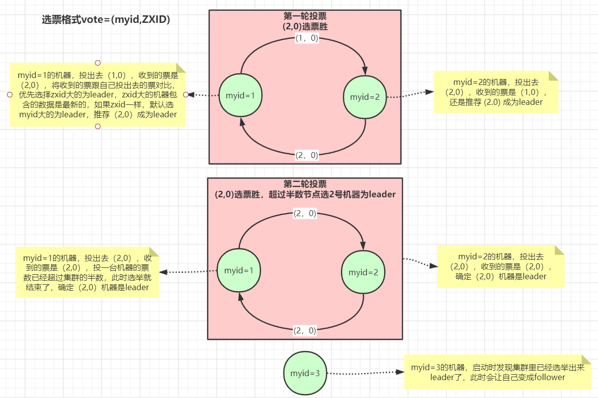

## Zookeeper 

#### 应用场景
- 分布式配置中心
- 分布式注册中心
- 分布式锁
- 集群选举
- 发布订阅
####核心概念
- 分布式协调框架
- 基于内存的数据库
- 维护了一个类似文件系统的数据结构
#### 节点类型
- 持久化节点
- 持久化顺序节点
- 临时节点（生命周期与session绑定，30秒超时。可以在客户端配置），不能有子节点
- 临时顺序节点
- container节点，没有子节点60秒后删除
- ttl节点，可以设置超时，后台轮询去检查删除
#### 监听
- 监听数据
- 监听节点
- 递归监听目录
#### 数据持久化
- 事务日志（磁盘空间预分配），数据更全
- 数据快照，快速恢复。某一时刻内存中的全量数据
#### 删除
- 删除的时候可以指定版本，乐观锁
- 指定-1会匹配所有版本
#### curator zookeeper客户端
- 递归创建节点
- protection防止重试创建僵尸节点
#### 集群模式
- leader 负责处理读写数据。先写事务日志，再发数据给其他follower，只有过半的follower也写事务日志成功后，leader才会把数据写内存
- follower 负责读数据，如果leader失效，可以参与选举投票，有机会成为新的leader。如果收到写请求会转发到leader
- Observre 负责读数据，减轻服务端写数据的压力
#### 分布式锁
- 非公平锁。连接较多时，压力较大
- 公平锁 顺序节点 curator
  - 父节点为容器节点，子节点临时顺序节点
- redis和zookeeper区别
  - zookeeper可靠性较高，但是写的性能略差，需要半数以上原则
  - redis数据可能丢失，性能较好
- 共享锁(共享锁)
#### 选举 
- 
- myid zxid 选zxid大的，zxid相同比较myid。节点数已配置文件里配置的为准

- zk的选举底层可以分为选举应用层和消息传输层，应用层有自己的队列收、发选票，传输层也设计了自己的队列，并按发送的机器分了队列，避免每台机器  
发送消息时相互影响，比如某台机器如果出问题发送不成功不会影响对正常机器的发送  
-   
#### ZAB协议
- zk原子广播协议
- zk为分布式服务提供高效且可靠的分布式协调服务。在解决分布式一致性方面，zk没有使用paxos，而是采用了ZAB协议，paxos的一种简化版算法
- 支持崩溃恢复和原子广播
- zk实现了一种主备架构来保持集群各副本之间数据的一致性
-   
- 消息广播
  - 类似二阶段提交的原子广播协议。
  - 客户端发送的写请求全部交由leader处理，leader将请求封装成proposal，将其发送给所有的follower，由半数以上的follower反馈成功则进行commit  
  操作
  - 每个proposal会有一个全局递增唯一的id，成为事务id（zxid），通过消息队列来保证顺序处理
  - leader和follower之间还有一个消息队列，来解耦，接触同步阻塞
  - 为保证集群所有进程都能够有序的顺序执行，只能是leader来处理写请求，follower接到写请求会转发给leader。follower只处理读请求
  - ZAB协议规定，如果一个事务在一台机器上执行成功，那么应该在所有机器上都执行成功，哪怕机器出现故障
  -  
#### 崩溃恢复
- leader复制数据给所有follower，还没来得及收到ack，挂掉
- leader收到ack发送部分commit之后挂掉
- 为此ZAB协议定义了两个原则
  - 确保丢弃那些只在leader提出/复制，没有commit的事务
  - 确保那些已经在leader提交的的事务，被所有follower提交
- 确保提交已经被leader提交的事务，丢弃已经被跳过的事务
- 选举算法思想：每次选举出来的leader都拥有所有机器zxid最大的事务，这样就能保证leader具有所有已经提交的事务
  - 可以省去leader检查事务的提交和丢弃工作这一步骤
- leader服务器处理或丢弃事务都是依赖着zxid的
  - zxid是一个64位数字，其中低32位可以看做一个简单的递增计数器，针对客户端的每一个事务请求，leader都会产生一个新的proposal并将该  
  计数器+1
  - 高32位则代表了leader上本地最大事务proposal的epoch值（leader选举周期），当一轮选举结束后，会对这个值+1，事务id从0开始 
  - 高32位代表了leader的唯一性，低32位代表每代事务的唯一性
    -  