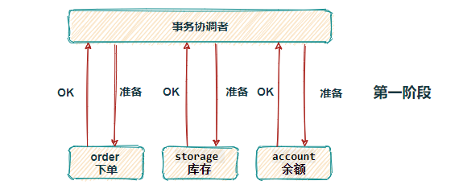
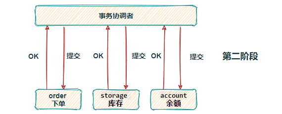
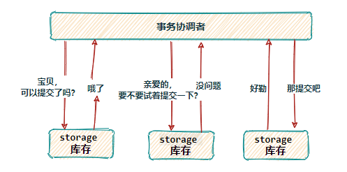
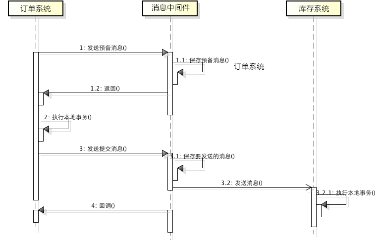

## 分布式事务

#### 概念
> 当系统业务体量很小时，应用单体架构完全可以支撑业务运行，所有业务共用一个数据库，复杂的流程在一个方法得一个事务里就能完成
> 随着业务的不断增涨，单体架构逐渐扛不住巨大的流量，需要对数据库、表分库分表，服务进行拆分，分为不同的中心（订单中心、库存中心等）
> 数据间隔离，通过RPC进行调用。一个复杂的操作可能伴随着多次服务间RPC调用，这样的情况下只能保证本地数据一致性，无法保证其他服务操作的
> 成功。因此需要分布式事务介入来保证事务的一致性
#### 分布式事务方案
> 实现分布式事务的方案有很多种
  - >基于XA协议的2pc、3pc，基于业务层的TCC，还有消息队列+消息表实现的事务最终一致性方案，以及seata中间件
    - >2pc:基于xa实现的分布式事务，xa协议：由事务管理器和本地资源管理器组成。其中本地资源管理器由数据库实现，而事务管理器则作为一个全
      > 局调度者.对业务的侵占性很小，开发者可以像使用本地事务一样来使用2pc来保证ACID特性
    - 
      > 2pc是强一致性的同步阻塞协议，事务执行过程中需要锁定所需资源，也就是刚性事务。适用于执行时间确定的短事务，性能比较差
      - 
      > 一旦事务协调者宕机或者发生网络抖动，会让参与者一直处于锁定资源的状态或者只有一部分参与者提交成功，导致数据的不一致。因此，在⾼并发  
      性能⾄上的场景中，基于 XA 协议的分布式事务并不是最佳选择。
  - >3pc:三段提交（3PC）是二阶段提交（2PC）的一种改进版本 ，为解决两阶段提交协议的阻塞问题，上边提到两段提交，当协调者崩溃时，参与者不能做  
    出最后的选择，就会一直保持阻塞锁定资源。2PC 中只有协调者有超时机制，3PC 在协调者和参与者中都引入了超时机制，协调者出现故障后，参与者就不  
    会一直阻塞。而且在第一阶段和第二阶段中又插入了一个准备阶段（如下图，看着有点啰嗦），保证了在最后提交阶段之前各参与节点的状态是一致的。
    - 
    > 虽然 3PC 用超时机制，解决了协调者故障后参与者的阻塞问题，但与此同时却多了一次网络通信，性能上反而变得更差
- >所谓的 TCC 编程模式，也是两阶段提交的一个变种，不同的是 TCC 为在业务层编写代码实现的两阶段提交。TCC 分别指 Try、Confirm、Cancel ，一个  
  业务操作要对应的写这三个方法。
  >下单扣库存为例，Try 阶段去占库存，Confirm 阶段则实际扣库存，如果库存扣减失败 Cancel 阶段进行回滚，释放库存。  
  > TCC 不存在资源阻塞的问题，因为每个方法都直接进行事务的提交，一旦出现异常通过则 Cancel 来进行回滚补偿，这也就是常说的补偿性事务。  
  > 原本一个方法，现在却需要三个方法来支持，可以看到 TCC 对业务的侵入性很强，而且这种模式并不能很好地被复用，会导致开发量激增。还要考虑  
  到网络波动等原因，为保证请求一定送达都会有重试机制，所以考虑到接口的幂等性。
- >消息事务（最终一致性）:消息事务其实就是基于消息中间件的两阶段提交，将本地事务和发消息放在同一个事务里，保证本地操作和发送消息同时成功。
  下单扣库存原理图：
  - 
  > 订单系统向 MQ 发送一条预备扣减库存消息，MQ 保存预备消息并返回成功 ACK
  > 接收到预备消息执行成功 ACK，订单系统执行本地下单操作，为防止消息发送成功而本地事务失败，订单系统会实现 MQ 的回调接口，其内不断的检查  
  > 本地事务是否执行成功，如果失败则 rollback 回滚预备消息；成功则对消息进行最终 commit 提交。
  > 库存系统消费扣减库存消息，执行本地事务，如果扣减失败，消息会重新投，一旦超出重试次数，则本地表持久化失败消息，并启动定时任务做补偿。
  > 基于消息中间件的两阶段提交方案，通常用在高并发场景下使用，牺牲数据的强一致性换取性能的大幅提升，不过实现这种方式的成本和复杂度是比较高的，还要看实际业务情况。
- >Seata:Seata 也是从两段提交演变而来的一种分布式事务解决方案，提供了 AT、TCC、SAGA 和 XA 等事务模式，这里重点介绍 AT模式。
  - >Transaction Coordinator(TC): 全局事务协调者，用来协调全局事务和各个分支事务（不同服务）的状态， 驱动全局事务和各个分支事务的回滚或提交。
  - >Transaction Manager™: 事务管理者，业务层中用来开启/提交/回滚一个整体事务（在调用服务的方法中用注解开启事务）。
  - >Resource Manager(RM): 资源管理者，一般指业务数据库代表了一个分支事务（Branch Transaction），管理分支事务与 TC 进行协调注册分支事务并且汇报分支事务的状态，
    > 驱动分支事务的提交或回滚。
    >>Seata 实现分布式事务，设计了一个关键角色 UNDO_LOG （回滚日志记录表），我们在每个应用分布式事务的业务库中创建这张表，这个表的核心作用就是，将业务数据在更新前后  
     的数据镜像组织成回滚日志，备份在 UNDO_LOG 表中，以便业务异常能随时回滚。
    - > 第一个阶段：执行本地业务，将业务数据的更新和回滚日志在同一个本地事务中提交，分别插入到业务表和 UNDO_LOG 表中。
    >>在本地事务提交前，各分支事务需向 全局事务协调者 TC 注册分支 ( Branch Id) ，为要修改的记录申请 全局锁 ，要为这条数据加锁，利用 SELECT FOR UPDATE 语句。  
    而如果一直拿不到锁那就需要回滚本地事务。TM 开启事务后会生成全局唯一的 XID，会在各个调用的服务间进行传递。
    有了这样的机制，本地事务分支（Branch Transaction）便可以在全局事务的第一阶段提交，并马上释放本地事务锁定的资源。相比于传统的 XA 事务在第二阶段释放资源，  
    Seata降低了锁范围提高效率，即使第二阶段发生异常需要回滚，也可以快速 从UNDO_LOG 表中找到对应回滚数据并反解析成 SQL 来达到回滚补偿。 
    最后本地事务提交，业务数据的更新和前面生成的 UNDO LOG 数据一并提交，并将本地事务提交的结果上报给全局事务协调者 TC。  
    - > 第二阶段是根据各分支的决议做提交或回滚：
      - >回滚:收到 TC 的分支回滚请求，开启一个本地事务，通过 XID 和 Branch ID 查找到相应的 UNDO LOG 记录。
        数据校验：拿 UNDO LOG 中的后镜与当前数据进行比较，如果有不同，说明数据被当前全局事务之外的动作做了修改。这种情况，需要根据配置策略来做处理，详细的说明在另外的文档中介绍。
        根据 UNDO LOG 中的前镜像和业务 SQL 的相关信息生成并执行回滚的语句：收到 TC 的分支回滚请求，开启一个本地事务，执行如下操作。
        通过 XID 和 Branch ID 查找到相应的 UNDO LOG 记录。
        数据校验：拿 UNDO LOG 中的后镜与当前数据进行比较，如果有不同，说明数据被当前全局事务之外的动作做了修改。这种情况，需要根据配置策略来做处理，详细的说明在另外的文档中介绍。
        根据 UNDO LOG 中的前镜像和业务 SQL 的相关信息生成并执行回滚的语句：
    - > 提交:收到 TC 的分支提交请求，把请求放入一个异步任务的队列中，马上返回提交成功的结果给 TC。
      异步任务阶段的分支提交请求将异步和批量地删除相应 UNDO LOG 记录。这里删除回滚日志记录操作，一定是在本地业务事务执行之后  
    [参考博文](https://www.cnblogs.com/chengxy-nds/p/14046856.html).  
    [seata](https://seata.io/zh-cn/docs/dev/mode/at-mode.html).

