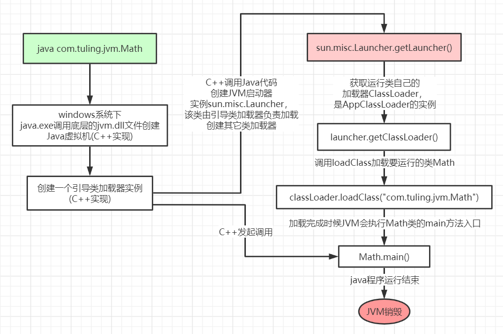
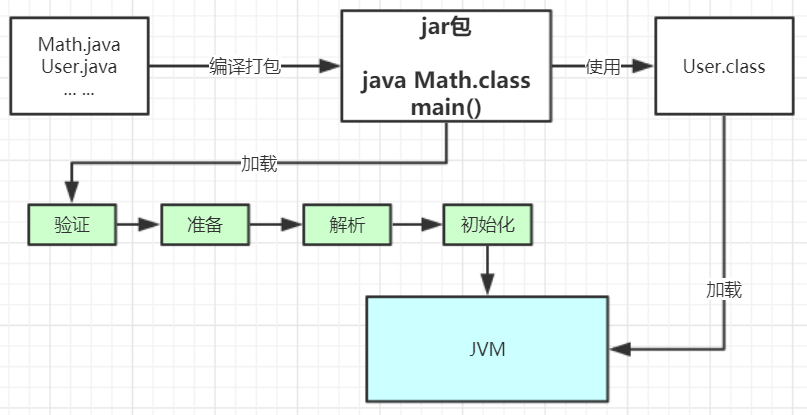
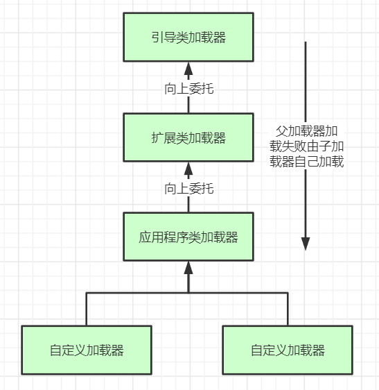
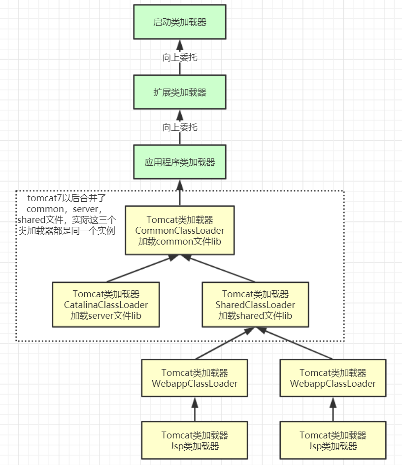

## 类加载
- 流程图
- 
- 
- 步骤
  - 加载：加载硬盘上的字节码文件到内存，生成class对象。数组类本身不通过类加载器创建，它是由Java虚拟机直接在
    内存中动态构造出来的。但数组类与类加载器仍然有很密切的关系，因为数组类的元素类型（Element
    Type，指的是数组去掉所有维度的类型）最终还是要靠类加载器来完成加载
    - 通过一个类的全限定名来获取定义此类的二进制字节流。
      - 还可以：
        - 在内存中生成一个代表这个类的java.lang.Class对象，作为方法区这个类的各种数据的访问入
          口。
        - 从网络中获取，这种场景最典型的应用就是Web Applet。
        - ·由其他文件生成，典型场景是JSP应用，由JSP文件生成对应的Class文件。
        - 从数据库中读取，这种场景相对少见些，例如有些中间件服务器（如SAP Netweaver）可以选择
          把程序安装到数据库中来完成程序代码在集群间的分发。
        - 可以从加密文件中获取，这是典型的防Class文件被反编译的保护措施，通过加载时解密Class文
          件来保障程序运行逻辑不被窥探。
    - 将这个字节流所代表的静态存储结构转化为方法区的运行时数据结构。
    - 在内存中生成一个代表这个类的java.lang.Class对象，作为方法区这个类的各种数据的访问入
      口。
  - 验证：校验字节码文件的正确性，这一阶段的目的是确保Class文件的字节流中包含的信息符合《Java虚
    拟机规范》的全部约束要求，保证这些信息被当作代码运行后不会危害虚拟机自身的安全。
    - 文件格式验证
      - 是否以魔数0xCAFEBABE开头。
      - 常量池的常量中是否有不被支持的常量类型（检查常量tag标志）。等等
    - 元数据验证
      - ·这个类是否有父类（除了java.lang.Object之外，所有的类都应当有父类）。
      - ·这个类的父类是否继承了不允许被继承的类（被final修饰的类）。
      - ·这个类的父类是否继承了不允许被继承的类（被final修饰的类）。
      - 类中的字段、方法是否与父类产生矛盾（例如覆盖了父类的final字段，或者出现不符合规则的方
        法重载，例如方法参数都一致，但返回值类型却不同等）。
    - 字节码验证，确定程序语义是合法的、符合逻辑的
    - 4.符号引用验证，发生在虚拟机将符号引用转化为直接引用[3]的时候，这个转化动作将在
      连接的第三阶段——解析阶段中发生
      - 符号引用中通过字符串描述的全限定名是否能找到对应的类。
      - 在指定类中是否存在符合方法的字段描述符及简单名称所描述的方法和字段。
      - 符号引用中的类、字段、方法的可访问性（private、protected、public、<package>）是否可被当
        前类访问。
  - 准备：各类的静态变量分配内存赋初默认值
  - 解析：将符号引用转换为直接引用，该阶段会把一些静态方法（符号引用，比如main方法）替换为指向数据所存内存的地址或指针，这就是所谓的的动态链接。  
  动态链接是指在运行期间完成符号引用替换为直接引用
    - 类或接口的解析
    - 字段解析
    - 方法解析
    - 方法解析
  - 初始化：各类的静态变量赋指定值，执行静态代码块
  - 使用
  - 卸载
- 加载、验证、准备、初始化和卸载这五个阶段的顺序是确定的，类型的加载过程必须按
  照这种顺序按部就班地开始，而解析阶段则不一定：它在某些情况下可以在初始化阶段之后再开始，
  这是为了支持Java语言的运行时绑定特性（也称为动态绑定或晚期绑定）。请注意，这里笔者写的是
  按部就班地“开始”，而不是按部就班地“进行”或按部就班地“完成”，强调这点是因为这些阶段通常都
  是互相交叉地混合进行的，会在一个阶段执行的过程中调用、激活另一个阶段。
- 其中验证、准备、解析三个部分统称
  为连接（Linking）
- 加载阶段与连接阶段的部分动作（如一部分字节码文件格式验证动作）是交叉进行的，加载阶段
    尚未完成，连接阶段可能已经开始，但这些夹在加载阶段之中进行的动作，仍然属于连接阶段的一部
    分，这两个阶段的开始时间仍然保持着固定的先后顺序
- 类被加载到方法区后主要包含：运行时常量池、类型信息、字段信息、方法信息、类加载器引用、对应class实例等
  - 类加载器：加载类
  - 类实例：作为方法区中访问类定义的入口
#### 类加载器由上至下  类加器是不管你是什么版本的，只在乎你的全限定类名，并且只有一份
- 引导类加载器（Launche，c++实现，开发不可见）：加载jre的lib目录下的核心类库 rt.jar、charset.jar
- 扩展类加载器（ExtClassLoader）:加载jre的lib目录下的ext扩展目录中的jar
- 应用类加载器（AppClassLoade）：负责加载calsspath下的类包
- 自定义类加载器（自定义类加载器的父加载器都为应用类加载）：加载用户自定义路径下的jar
### 类加载器
- 任意一个类，都必须由加载它的类加载器和这个类本身一起共同确立其在Java虚拟机中的唯一性
- 比较两个类是否“相 等”，只有在这两个类是由同一个类加载器加载的前提下才有意义，否则，即使这两个类来源于同一个
  Class文件，被同一个Java虚拟机加载，只要加载它们的类加载器不同，那这两个类就必定不相等。
#### 双亲委派
- 
- 流程
  - 先检查下类是否已经加载，如果已加载直接返回
  - 未加载看是否有父加载器，有的话调用父加载器进行加载或者bootstrrap类加载器进行加载
  - 如果父类加载和bootatrap类加载器都加载不到当前类，则由当前类加载器进行加载
- 双亲委派目的
  - 沙箱安全机制：防止核心类库被篡改
  - 避免类的重复加载，保证加载类的唯一性
- 自定义类加载器继承 java.lang.ClassLoader 类，重写findclass（）
- 三次破坏双亲委派
  - 兼容早期版本
  - 基础类型要调用用户的代码
  - 最求程序的动态性（代码热替换，程序热部署等）
#### 打破双亲委派
- tomcat
  - 保证每个应用程序类库隔离
  - 相同类库相同版本共享
  - web容器类库与应用程序类库隔离
  - jsp修改不重启
  - 
- 同一个JVM内，两个相同包名和类名的类对象可以共存，因为他们的类加载器可以不一
  样，所以看两个类对象是否是同一个，除了看类的包名和类名是否都相同之外，还需要他们的类
  加载器也是同一个才能认为他们是同一个