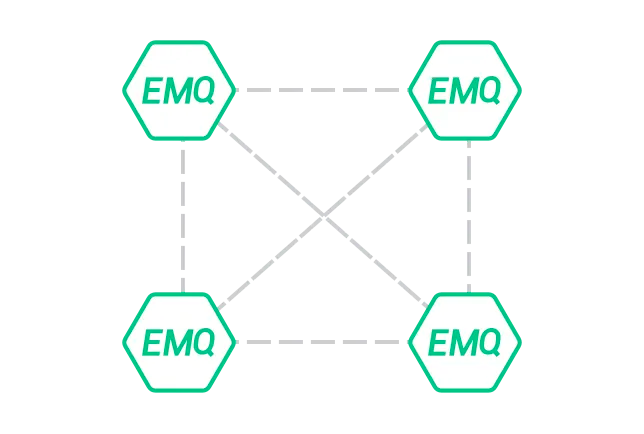
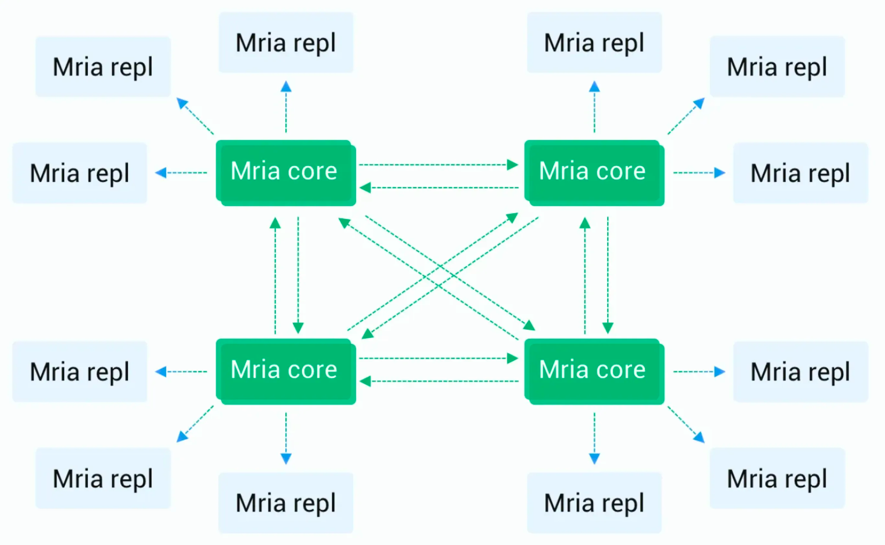
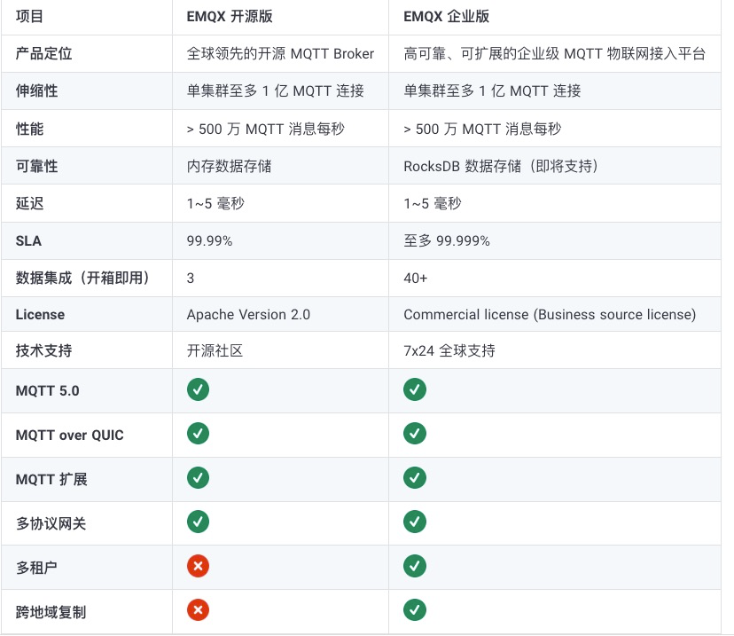
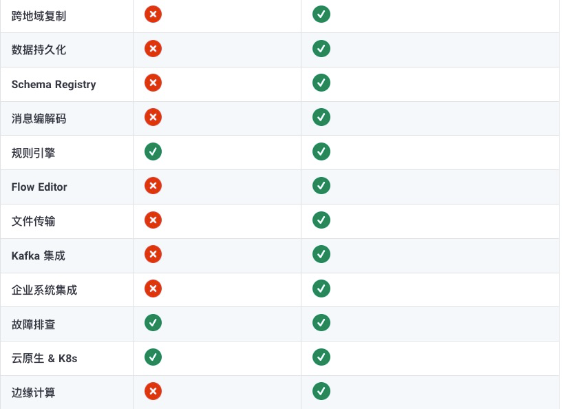
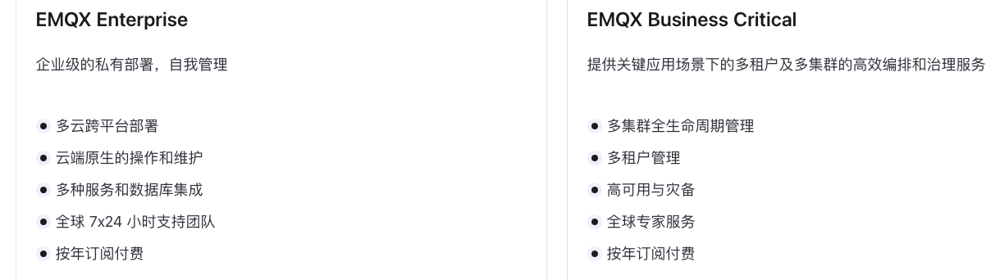
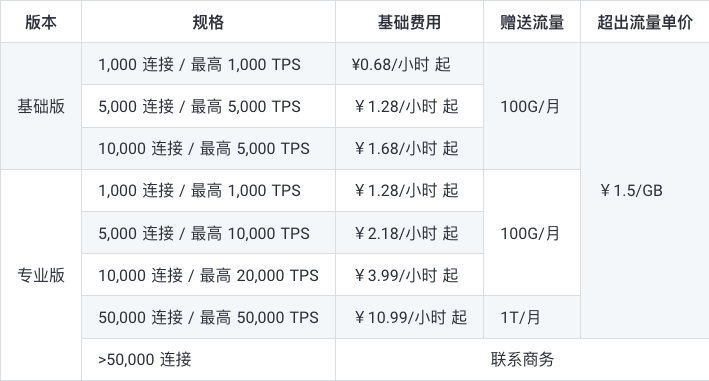
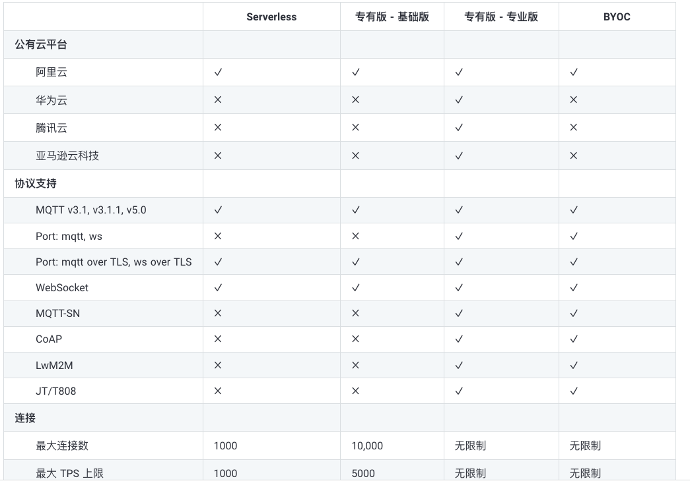
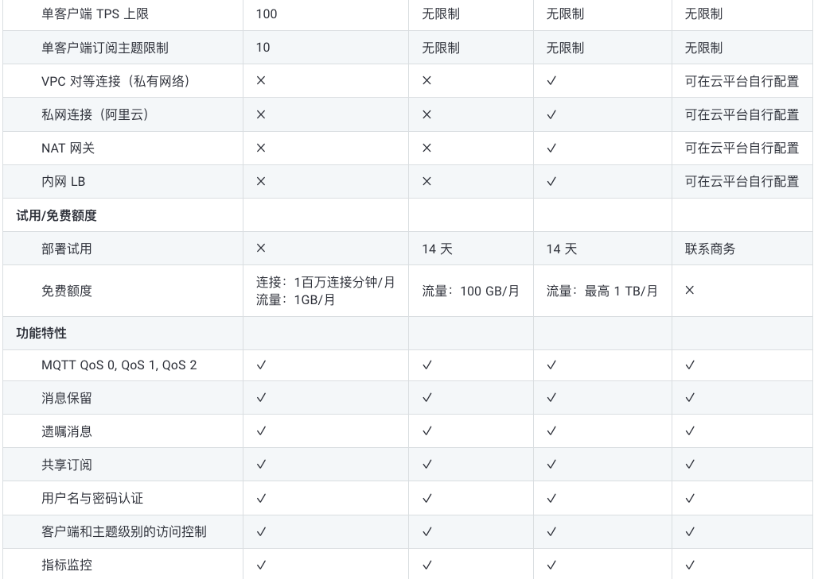
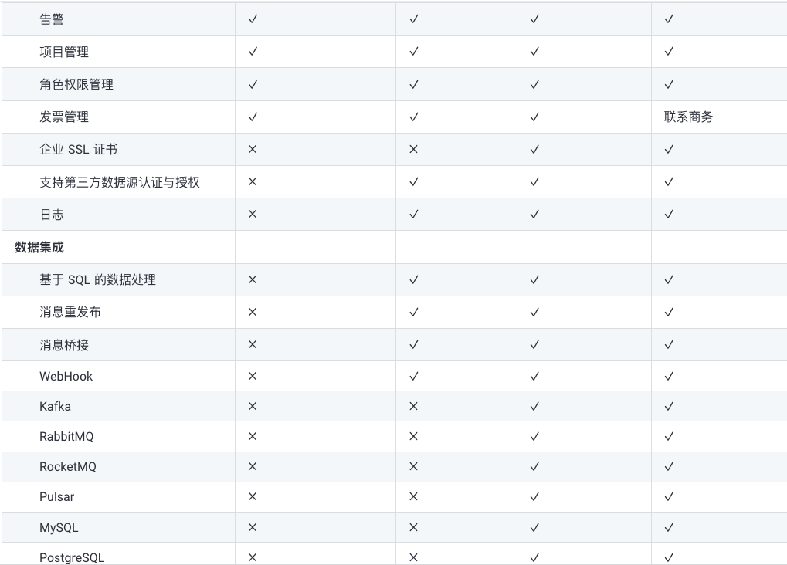
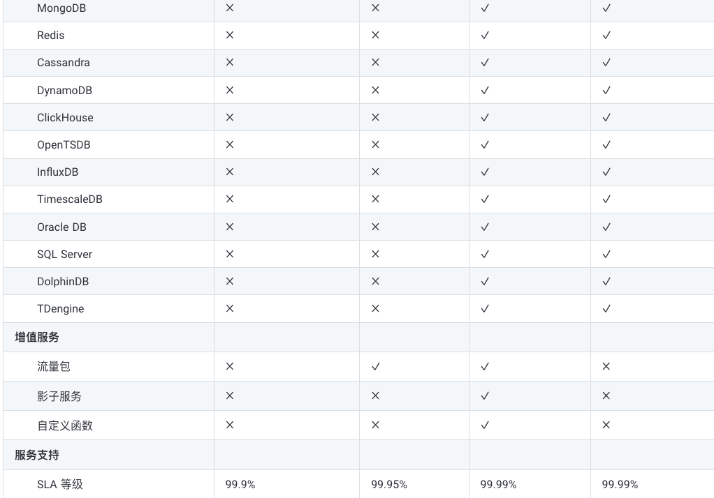

# mqtt各版本对比
## 开源4.x
- 每个 Erlang 运行系统被称为节点(Node)，节点(Node) 间通过 TCP 互联，消息传递的方式通信
- 企业版单机能支持百万的 MQTT 连接；集群能支持千万级别的 MQTT 连接；
  - 开源版单机稳定支撑链接10w
  - 订阅，路由，主题数据，消息qos等级也会影响接入量
  - 瞬时接入会进一步打折扣
- 开源版随着接入数量上升，可能会面临未知问题（开源版本身支撑上限）
- 4.4之前版本不再维护
- 
- v4.3.0 改进大量客户端离线时的处理性能
- v4.3.2 修复客户端大量离线时可能出现崩溃的问题
- 升级到 4.4.16 可以解决踢连接 timeout 的问题
- 4.4 EMQX 提供对接入速度、消息速度的限制：当客户端连接请求速度超过指定限制的时候，暂停新连接的建立
- 集群原理可简述为下述两条规则:
  - MQTT 客户端订阅主题时，所在节点订阅成功后广播通知其他节点：某个主题(Topic)被本节点订阅。
  - MQTT 客户端发布消息时，所在节点会根据消息主题(Topic)，检索订阅并路由消息到相关节点。
  - EMQ X 消息服务器同一集群的所有节点，都会复制一份主题(Topic) -> 节点(Node)映射的路由表
## 开源5.0
- 亿级（5000w发，5000w收，一对一链接）20复制节点，3主节点（写）。机器（64c，120g）
  - 1 对 1 消息吞吐
  - 每个接收端均订阅一个对应的发送端 pub 主题
  - 消息中的有效负载大小始终为 256 字节
  - 一个节点在发布过程中平均用到90% 的内存（约 113GiB）和约 97% 的 CPU
  - 在发布高峰期，loadgen 需要几乎全部内存（约 120GiB）和整个 CPU。
- EMQX 5.0 采用 Mria (opens new window)架构，实现了新的集群架构并重构了数据复制逻辑，  
由此 EMQX 5.0 水平扩展能力得到了指数级提升，这也是 EMQX 5.0 单个集群支持 1 亿 MQTT 连接的关键
- EMQX 节点之间的连接模式从 Mnesia 的全网状拓扑结构转向 Mria 的网状+星型状拓扑结构，集群中节点可  
以按角色分为核心节点（Core）或复制者节点（Replicant）。
- 
- 节点类型
  - 核心节点：作为数据库的数据层以全网状结构连接，每个节点都包含了最新的数据副本。保证容错。核心节点  
  一般是静态和持久的，不建议进行自动伸缩（即经常添加、删除或替换节点）。
  - 复制节点：复制节点会连接到核心节点，并被动地复制来自 核心节点的数据更新。复制节点不允许执行任何的写  
  操作，而是将其转交给核心节点代为执行。同时，由于复制节点有一个完整的本地数据副本，因此数据读取速度非常快，这样有助于降低 EMQX 路由的时延。
- 架构优势
  - 更高的水平可扩展性：EMQX 5.0 已能支持包含 23 个节点的大规模集群。
  - 更轻松的集群自动扩展：通过复制节点的自动伸缩简化集群的自动扩展。
  - 相比与 4.x 版本所有节点采用全连接的方式，节点数量越多节点之间完成数据同步的成本就越高，  
  EMQX 5.0 中由于复制节点不参与数据写入，当更多的复制节点加入集群时，表的更新效率不会受到影响，进而允许创建更大的 EMQX 集群
  - 但随着总数据量的增大，从核心节点初始化复制数据是一个相对繁重的操作，所以复制节点的自动伸缩策略不也能太过于激进。
- 在 EMQX 5.0 中，所以如果不做任何调整的话所有节点都默认为核心节点，默认行为和 4.x 版本是一致的，这能够避免增加上手和使用的难度，  
您可以按照 4.x 版本的使用经验进行集群部署。只有集群规模超过 3 个节点，才建议你使用 Core + Replicant 复制模式。
- 在小型集群中（3个节点或更少），没有必要使用 Core + Replicant 复制模式，而是让核心节点承载所有连接。
- 在超大的集群中（10 个节点或更多），核心节点不承载 MQTT 连接，这样更加稳定性和水平扩展性更好。
- 在中型集群中，核心节点是否承载 MQTT 连接取决于许多因素，需要根据您实际的场景测试才能知道哪个选择更优。
## Enterprise 4.3
- 测试报告。[测试报告](https://xmeter-cloud.emqx.com/commercialPage.html#/collaboration_reports/928993483/monitor?_k=tqqdad)
- 测试 EMQX 企业版 4.3.6 压测1h
  - 单节点(32c,64g) 
  - 1 对 1 消息吞吐
  - 每个接收端均订阅一个对应的发送端 pub 主题
  - 每个 pub 客户端每秒发送 2 条 QoS 1、payload 为 1k 字节的消息
  - 消息发送和接收均为每秒 10 万，总的消息吞吐达到每秒 20 万
  - 10(5pub+5sub) 万并发连接下支持,5w topic
  - 20 万 QoS 1 消息吞吐所需 EMQX 资源及响应时间等性能指标。
## 开源 VS Enterprise
- 
- 
- 4.x接入设备量级：开源版的稳定接入为 10 万，而企业版为 100 万。
- 5.0未说明两者之间稳定接入的差别
- 4.x集群接入上限为千万级别，5.x接入上限为亿级别
- 过期有不维护风险
- 数据持久化
## EMQX Cloud 和 EMQX Enterprise 有什么关系？
- 部署是由 EMQX Cloud 托管的 EMQX Enterprise 集群。客户可以根据自己的需求选择配置并可随时伸缩。
## EMQX Cloud支持哪些云平台？
- 国内：阿里云、腾讯云、华为云、AWS中国区；
- 国外：AWS，Azure，Google Cloud Platform。
## 建了 VPC 对等连接，自己的服务如何通过内网去连接 MQTT 服务
- 专业版部署在开通增值服务 - 内网负载均衡后可以通过内网连接地址连接到 EMQX Cloud 部署。
## 收费方式
- Enterprise：按接入设备购买license
  - EMQX Enterprise 企业级的私有部署，自我管理
  - EMQX Business Critical 提供关键应用场景下的多租户及多集群的高效编排和治理服务
  - 对比
  - 
  - 提供技术支持，时效性高
- Enterprise Cloud
  - Serverless 共享集群的 MQTT 服务，按使用量计费，免费额度以内使用完全免费。最高支持 1000 同时在线连接。
    - 计费
      - 连接：连接的客户端 * 客户端连接的时间（以分钟计算，不足一分钟以一分钟计算） / 1,000,000 * 8 ¥ 8.00 每一百万连接分钟
      - 流量：部署流入和流出的消息产生的流量byte）/ 1024 / 1024 / 1024 * 1.5 ¥ 1.5 / GB
  - 专有版
    - 基础版：适用于标准吞吐和并发量业务场景下的独立的 MQTT 服务 
      - 最高1w连接
    - 专业版：高可用的 MQTT 集群服务，是您在生产环境使用的最佳选择。支持实时数据处理、数据持久化、消息分发、VPC 对等连接（私有网络）等高级功能
      - 连接无限制
    - 计费
    - 
  - BYOC (Bring Your Own Cloud)在您自己的云上部署 EMQX 集群，并交由 EMQX 团队托管。所有数据都将保存在您自己的数据中心，满足公司业务数据私有化的场景需求
    - EMQX Cloud BYOC 会在您的云平台账号中部署 EMQX 服务，相关费用包括云平台资源费用和 EMQX Cloud BYOC 许可证费用。
  - 对比
  - 
  - 
  - 
  - 
## v4-->v5升级影响
- 日志格式变动
- 默认监听器变动
  - MQTT-TCP 11883 不再提供。本机的tcp端口
  - Management-HTTP 8081	REST API 端口，已合并至 18083 端口
- 插件
- HTTP API
  - 响应数据格式调整
- 认证/发布订阅 ACL
- 规则引擎
- webhook
- mqtt桥接
- prometheus
- 网管多协议几接入
- 遥测
## iot hub 设备的注册管理平台
  - 限制
    - 近两年更新不活跃。生态不丰富。开发者接入不多
    - 终端接入需下载相应的sdk，熟悉接入流程，有开发成本
      - 需要手动创建产品
      - 需要相应开发完成每个设备的动态注册
      - 接入方式需要重新开发
    - 设备只能发布和订阅自身的 topic 消息。基于规则引擎的 repub 功能，可实现设备消息互通。
      - 终端和设备都需要调整订阅逻辑
    - 不支持qos2，retain msg
    - 消息max 16kb
    - 无法进行个性化适配，需遵循iot hub规范
    - 耦合程度比较高
    - 使用同一个设备证书信息，在同一时间，只能和平台服务器建立一个连接。
    - 数据透明（运营设备完全透明）
- 优点
  - 实现设备管理（状态监控、设备数据上报和设备下控等）功能
  - 无维护压力，全托管
  - 包含固件升级
##  计费 
- 连接，消息量，升级次数组合收费
  - 3.6元/百万条消息。消息内容长度以单位字节数（512Bytes）结算后的消息计数
  - 1.0元/百万分钟。不足1分钟按1分钟计
  - 0.2元/次（ota）。每100MB算1次，且不足100 MB的部分也按1次计算

- 高线 5w dev 8w  vpc
- license 5w 7*24 18.72   3.7   10  2.8   20  1.3

$share/rw_router_test/lift/+/+/topic/state
$share/autoDiagnose/robot/+/+/topic/auto_diagnose

共享订阅主题检查（带群组，不带群组）